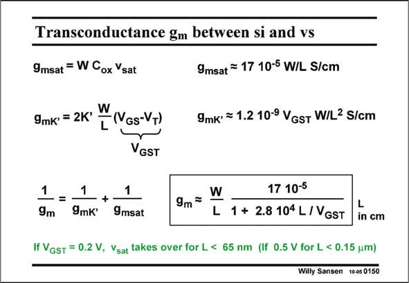

# SANSEN-0150 · Transconductance gm between si and vs

章节：01 MOS 晶体管与双极型晶体管的比较  
PDF 页：27；书本页：27；幻灯片编号：0150  
状态：unreviewed



## 对应教材讲解

### PDF 27 · 书本 27

The transconductance g is m easily found in both regions; g is the one in velocity msat saturation, whereas g is mK∞ the one in strong inversion. They are given in this slide. Again, substitution of the technological parameters yields expressions for both transconductances in which only W and L are left explicitly. An expression of the transconductance g coverm ing both regions can be obtained by simply putting both ‘‘in parallel’’. The total transconductance g is then always smaller than the smaller one of both. m In this way an expression is obtained with both W and L, and obviously V −V . This GS T expression will be used later on to optimize some high-speed circuits, but also operational amplifiers. For a specific V −V , this total transconductance is easily plotted versus channel length L, GS T as shown next.

## 公式／性能结论候选摘录

以下为规则截取的原文，尚未逐项判读。

（未由规则找到；不代表原页没有此类内容。）

## 曲线结论候选摘录

以下为规则截取的原文，尚未逐项判读。

- PDF 27: For a specific V −V , this total transconductance is easily plotted versus channel length L, GS T as shown next.

## 原文条件与近似候选摘录

以下为规则截取的原文，尚未逐项判读。

- PDF 27: The transconductance g is m easily found in both regions; g is the one in velocity msat saturation, whereas g is mK∞ the one in strong inversion.

## 幻灯片 OCR（未校正）

```text
Transconductance gm between si and vs
9msat = W Cox Ysat
9msat = 17 10-5 W/L S/cm
9mk' = 2K' W
-(GS-VT)
L
9mk' = 1.2 10-9 VGsT W/L2 S/cm
VGST
1
9m
=
1
-+
9mK
1
9msat
9m=
W
17 10-5
L 1 + 2.8 104 L/VGST
L
in cm
If VGsT = 0.2 V, Vsat takes over for L < 65 nm (If 0.5 V for L < 0.15 um)
Willy Sansen 10-05 0150
```

数学上下标、分数及正负号以原图为准。电路图已保留；未核对的连接不输出成可仿真 netlist。
