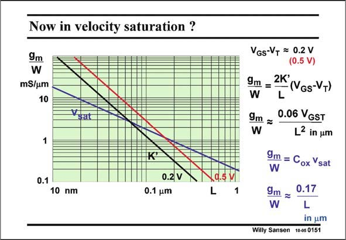

# SANSEN-0151 · Now in velocity saturation ? VGs-VT = 0.2 V

章节：01 MOS 晶体管与双极型晶体管的比较  
PDF 页：28；书本页：28；幻灯片编号：0151  
状态：unreviewed



## 对应教材讲解

### PDF 28 · 书本 28

For a specific V −V , the GS T total transconductance is easily plotted versus channel length L, as shown next. Actually, both transconductances are plotted separately. The transconductance in saturation is in blue; the one in strong inversion for V =0.2 V in black and GST for V =0.5 V in red. For GST V =0.2 V, the crossover GST is around 65 nm channel length. This means that nowadays for analog designs in 0.13 mm and 0.18 mm, we can still use the model in strong inversion and that a small factor of h is sufficient to provide accurate values of transconductance. For high-frequency applications however, in which V =0.5 V or higher, the crossover value GST of channel length is about 0.15 mm. Transistors in a 90 nm technology operate mainly in velocity saturation. Parameter h is then much larger, and certainly cannot be neglected.

## 公式／性能结论候选摘录

以下为规则截取的原文，尚未逐项判读。

（未由规则找到；不代表原页没有此类内容。）

## 曲线结论候选摘录

以下为规则截取的原文，尚未逐项判读。

- PDF 28: For a specific V −V , the GS T total transconductance is easily plotted versus channel length L, as shown next.
- PDF 28: Actually, both transconductances are plotted separately.

## 原文条件与近似候选摘录

以下为规则截取的原文，尚未逐项判读。

- PDF 28: The transconductance in saturation is in blue; the one in strong inversion for V =0.2 V in black and GST for V =0.5 V in red.
- PDF 28: Transistors in a 90 nm technology operate mainly in velocity saturation.
- PDF 28: Parameter h is then much larger, and certainly cannot be neglected.

## 幻灯片 OCR（未校正）

```text
Now in velocity saturation ?
9m
W
mS/um
10
Vsat
1
K°
0.1
10 nm
0.2 V
0.1 um
4.5 M
L
1
VGs-VT = 0.2 V
(0.5 V)
9m =
2K'
(VGs-VT)
W
L
9m =
W
0.06 VGST
L2 in um
9m = Cox Vsat
W
9m =
0.17
W
L
in um
Willy Sansen
10-0s 0151
```

数学上下标、分数及正负号以原图为准。电路图已保留；未核对的连接不输出成可仿真 netlist。
