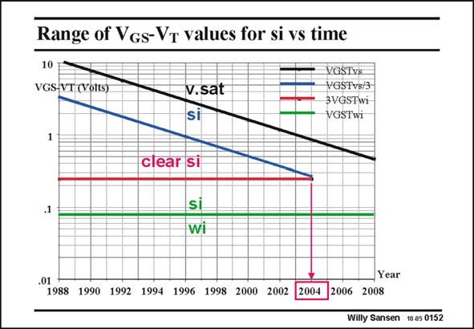

# SANSEN-0152 · Range of Vgs-Vr values for si vs time

章节：01 MOS 晶体管与双极型晶体管的比较  
PDF 页：28；书本页：28；幻灯片编号：0152  
状态：unreviewed



## 对应教材讲解

### PDF 28 · 书本 28

As the channel lengths become smaller all the time, as predicted by the curve of Moore, given at the beginning of this Chapter, they can be predicted for the near future. For each different channel length we can estimate the transition voltage V GSTvs between strong inversion and velocity saturation. It decreases versus channel length L. It is given by the top black line. To stay out of velocity saturation altogether we want to take a safety margin of a factor of three in V or ten in GST current I . This is the blue line. It obviously also decreases versus channel length or time. DS The transition voltage V between weak and strong inversion on the other hand, is indepen- GSt dent of the channel length. It is always about 70 to 80 mV. This is the green line. To stay out of the region (of moderate inversion) close to this transition point, again a safety margin is taken of three in V or ten in current. This is the red line. GST

### PDF 29 · 书本 29

The region between the blue and red line is thus the range of V values in which a square- GST law characteristic can easily be identified. As clearly shown, this region has just about disappeared. This seems to have happened in 2004! In other words, in future, MOST models are required which are no more extrapolations of a square-law model but which connect an exponential to a linear curve, as bipolar models do!

## 公式／性能结论候选摘录

以下为规则截取的原文，尚未逐项判读。

- PDF 28: It decreases versus channel length L.
- PDF 28: It obviously also decreases versus channel length or time.
- PDF 29: The region between the blue and red line is thus the range of V values in which a square- GST law characteristic can easily be identified.

## 曲线结论候选摘录

以下为规则截取的原文，尚未逐项判读。

- PDF 28: As the channel lengths become smaller all the time, as predicted by the curve of Moore, given at the beginning of this Chapter, they can be predicted for the near future.
- PDF 29: The region between the blue and red line is thus the range of V values in which a square- GST law characteristic can easily be identified.
- PDF 29: In other words, in future, MOST models are required which are no more extrapolations of a square-law model but which connect an exponential to a linear curve, as bipolar models do!

## 原文条件与近似候选摘录

以下为规则截取的原文，尚未逐项判读。

- PDF 28: For each different channel length we can estimate the transition voltage V GSTvs between strong inversion and velocity saturation.
- PDF 28: To stay out of velocity saturation altogether we want to take a safety margin of a factor of three in V or ten in GST current I .

## 幻灯片 OCR（未校正）

```text
Range of Vgs-Vr values for si vs time
10
VGS-VT (Volts)
v.sat
si
VGSTvS
VGSTvs/3
3VGSTwi
VGSTwi
clear si
si
wi
.01
1988 1990 1992 1994 1996 1998 2000 2002
2004
Year
2006 2008
Willy Sansen 10.05 0152
```

数学上下标、分数及正负号以原图为准。电路图已保留；未核对的连接不输出成可仿真 netlist。
