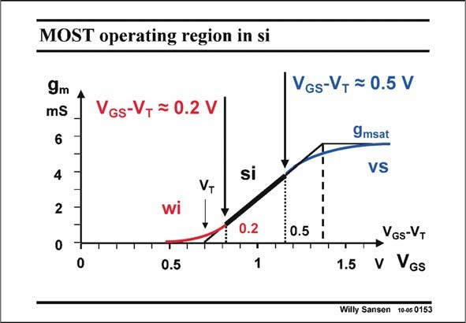

# SANSEN-0153 · MOST operating region in si

章节：01 MOS 晶体管与双极型晶体管的比较  
PDF 页：29；书本页：29；幻灯片编号：0153  
状态：unreviewed



## 对应教材讲解

### PDF 29 · 书本 29

As a result, the prediction of the current and the transconductance cannot be accurate any more. Indeed, in the middle of the square-law region, around V −V =0.2 V, GS T parameter K∞ contains the mobility and factor n, which are not accurate at all indeed. Moreover, for lower values of V −V , we end GS T up too close to weak inversion, complicating the model considerably. On the other side of the V −V range, velocity saturation is moving in closer and closer all GS T the time, requiring another level of complexity. It has now become very difficult to use simple models for hand calculations. The only good chance we have is around V −V #0.2 V for high gain and somewhat more (#0.5 V) for high GS T frequency applications. In all other regions elaborate models have to be used, which are only available from foundries.

## 公式／性能结论候选摘录

以下为规则截取的原文，尚未逐项判读。

- PDF 29: As a result, the prediction of the current and the transconductance cannot be accurate any more.
- PDF 29: The only good chance we have is around V −V #0.2 V for high gain and somewhat more (#0.5 V) for high GS T frequency applications.

## 曲线结论候选摘录

以下为规则截取的原文，尚未逐项判读。

（未由规则找到；不代表原页没有此类内容。）

## 原文条件与近似候选摘录

以下为规则截取的原文，尚未逐项判读。

- PDF 29: On the other side of the V −V range, velocity saturation is moving in closer and closer all GS T the time, requiring another level of complexity.

## 幻灯片 OCR（未校正）

```text
MOST operating region in si
9m
mS
VGs-V, = 0.2 V
6
4
VT
2
0
Si
0.2
VGs-VT = 0.5 V
9msat
VS
; 0.5
0
0.5
VGs-VT
1.5 V VGs
Willy Sansen 10-0s 0153
```

数学上下标、分数及正负号以原图为准。电路图已保留；未核对的连接不输出成可仿真 netlist。
