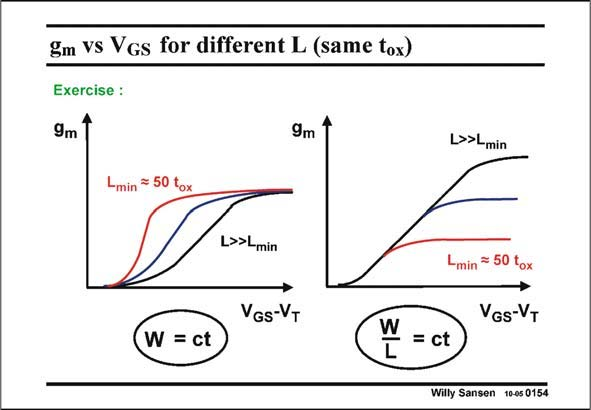

# SANSEN-0154 · gm vs Vgs for different L (same tox)

章节：01 MOS 晶体管与双极型晶体管的比较  
PDF 页：29；书本页：29；幻灯片编号：0154  
状态：unreviewed



## 对应教材讲解

### PDF 29 · 书本 29

As a conclusion let us try to understand how some of these important parameters change with the drive voltage V −V . As they are GS T meant as exercises, only a few comments are given. In both cases we have to try to figure out how the transconductance g m changes if we change the drive voltage V −V . GS T Both are for the same technology (constant oxide thickness and minimum channel length).

### PDF 30 · 书本 30

On the left however, we keep W constant, whereas on the right we keep W/L constant. Obviously the operating points are allowed to shift from weak inversion, over strong inversion to velocity operation.

## 公式／性能结论候选摘录

以下为规则截取的原文，尚未逐项判读。

- PDF 29: As a conclusion let us try to understand how some of these important parameters change with the drive voltage V −V .

## 曲线结论候选摘录

以下为规则截取的原文，尚未逐项判读。

（未由规则找到；不代表原页没有此类内容。）

## 原文条件与近似候选摘录

以下为规则截取的原文，尚未逐项判读。

（未由规则找到；不代表原页没有此类内容。）

## 幻灯片 OCR（未校正）

```text
gm vs Vgs for different L (same tox)
Exercise :
9m
9m
L>>Lmin
Lmin = 50 tox
L>>Lmin
VGS-VT
Lmin = 50 tox
GS-VT
W
W = ct
= ct
Willy Sansen 10-05 0154
```

数学上下标、分数及正负号以原图为准。电路图已保留；未核对的连接不输出成可仿真 netlist。
