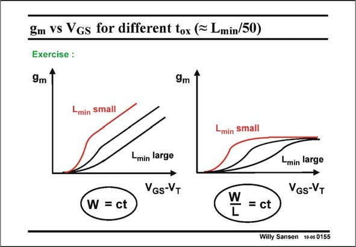

# SANSEN-0155 · gm vS Vgs for different tox (* Lmin/50)

章节：01 MOS 晶体管与双极型晶体管的比较  
PDF 页：30；书本页：30；幻灯片编号：0155  
状态：unreviewed



## 对应教材讲解

### PDF 30 · 书本 30

Similar curves can be generated if we jump from technology to technology. This would answer the question, what happens to the performance of an amplifier which has been designed in one technology and which is then transferred to another one without changing the layout. How would the transconductances change the high-frequency performance, etc.? Again, the operating points are allowed to shift from weak inversion, over strong inversion to velocity operation. This kind of reasoning is excellent to develop insight in the relation between several operating regions and the fundamental design parameters such as the transconductance.

## 公式／性能结论候选摘录

以下为规则截取的原文，尚未逐项判读。

（未由规则找到；不代表原页没有此类内容。）

## 曲线结论候选摘录

以下为规则截取的原文，尚未逐项判读。

- PDF 30: Similar curves can be generated if we jump from technology to technology.

## 原文条件与近似候选摘录

以下为规则截取的原文，尚未逐项判读。

（未由规则找到；不代表原页没有此类内容。）

## 幻灯片 OCR（未校正）

```text
gm vS Vgs for different tox (* Lmin/50)
Exercise :
9m
9m
Lmin small
Lmin small
-min large
VGS-VT
Lmin large
GS-VT
W = ct
W
L
= ct
Willy Sansen 10-05 0155
```

数学上下标、分数及正负号以原图为准。电路图已保留；未核对的连接不输出成可仿真 netlist。
