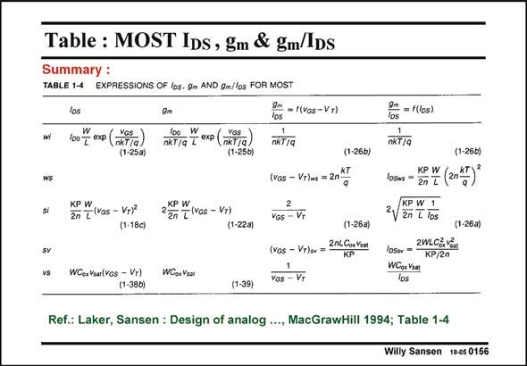

# SANSEN-0156 · Table : MOST IDs, gm & gm/IDs Summary :

章节：01 MOS 晶体管与双极型晶体管的比较  
PDF 页：30；书本页：30；幻灯片编号：0156  
状态：unreviewed



## 对应教材讲解

### PDF 30 · 书本 30

As a summary, this overview Table is copied from the reference. The expressions for the current, I , the transcon- DS ductance g and the g /I m m DS ratio’s are given horizontally for weak inversion, strong inversion and velocity saturation. Moreover, the transition or crossover values are denoted by ws for the transition between weak inversion and strong inversion, and by sv for the transition between strong inversion and velocity saturation.

## 公式／性能结论候选摘录

以下为规则截取的原文，尚未逐项判读。

（未由规则找到；不代表原页没有此类内容。）

## 曲线结论候选摘录

以下为规则截取的原文，尚未逐项判读。

（未由规则找到；不代表原页没有此类内容。）

## 原文条件与近似候选摘录

以下为规则截取的原文，尚未逐项判读。

- PDF 30: The expressions for the current, I , the transcon- DS ductance g and the g /I m m DS ratio’s are given horizontally for weak inversion, strong inversion and velocity saturation.
- PDF 30: Moreover, the transition or crossover values are denoted by ws for the transition between weak inversion and strong inversion, and by sv for the transition between strong inversion and velocity saturation.

## 幻灯片 OCR（未校正）

```text
Table : MOST IDs, gm & gm/IDs
Summary :
TABLE 1-4
EXPRESSIONS OF Ios. gm AND gm/los FOR MOST
wi
ws
si
los
100 exp
Yos
(nkT/a)
(1-25a)
KP W
2n 7 (kas - Vyjª
(1-18c)
gm
100 W exp (xaga)
(1-25b)
22P [ (vos - Vn)
(1-22a)
los - (ros -V*)
nkT/Q
(vos - Vr)ns = 2nKT
2
VGs - Vr
(1-266)
WCex Vuar(Vos - Vr)
(1-380)
WCox Vzat
(1-26a)
(vos - VT)w =
2nLCoRVI2!
KP
Vos - Vr
lo = (los)
NkT/q
(1-26b)
KP W
losm - 2P T (n*)
KP W 1
2V 2n I Tos
(1-26a)
1b5m = 2WLCổi Vẩn
KP/2n
WCox Ksat
los
(1-39)|
Ref.: Laker, Sansen : Design of analog .., MacGrawHill 1994; Table 1-4
Willy Sansen 10-os 0156
```

数学上下标、分数及正负号以原图为准。电路图已保留；未核对的连接不输出成可仿真 netlist。
