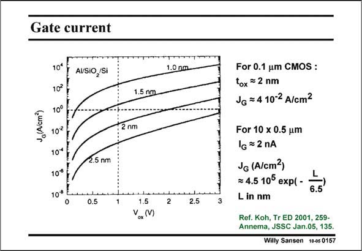

# SANSEN-0157 · Gate current

章节：01 MOS 晶体管与双极型晶体管的比较  
PDF 页：31；书本页：31；幻灯片编号：0157  
状态：unreviewed



## 对应教材讲解

### PDF 31 · 书本 31

As a final word of caution on these MOST models, before we tackle the capacitances, we have to have a look at the Gate current. For thin oxides, Gate leakage occurs. It is a result of tunneling through the oxide. It is thus proportional to the Gate area. It increases exponentially with thinner and thinner oxides, as illustrated in this slide. A numerical approximation is given for an oxide voltage of 1 V. It is clear that for CMOS technologies below 90 nm, this current cannot be neglected. This current behaves somewhat as a base current in a bipolar transistor. It still flows however, when the transistor is switched off, which is not the case in a bipolar transistor.

## 公式／性能结论候选摘录

以下为规则截取的原文，尚未逐项判读。

- PDF 31: It is thus proportional to the Gate area.
- PDF 31: It increases exponentially with thinner and thinner oxides, as illustrated in this slide.

## 曲线结论候选摘录

以下为规则截取的原文，尚未逐项判读。

（未由规则找到；不代表原页没有此类内容。）

## 原文条件与近似候选摘录

以下为规则截取的原文，尚未逐项判读。

- PDF 31: A numerical approximation is given for an oxide voltage of 1 V.
- PDF 31: It is clear that for CMOS technologies below 90 nm, this current cannot be neglected.

## 幻灯片 OCR（未校正）

```text
Gate current
J (A/cm)
10*
10
10°
102
10*
10% !
10% L
AUSIO,/Si
2.5 nm
0.5
1.5 nm
2 nml
1.5
VoxM)
1.0 nm.
2
2.5
For 0.1 um CMOS :
tox =2 nm
JG = 4 10-2 A/cm?
For 10 x 0.5 um
1G = 2 nA
JG (A/cm2)
= 4.5 105 еxр( -
L in nm
6.5
Ref. Koh, Tr ED 2001, 259-
Annema, JSSC Jan.05, 135.
Willy Sansen 10-05 0157
```

数学上下标、分数及正负号以原图为准。电路图已保留；未核对的连接不输出成可仿真 netlist。
