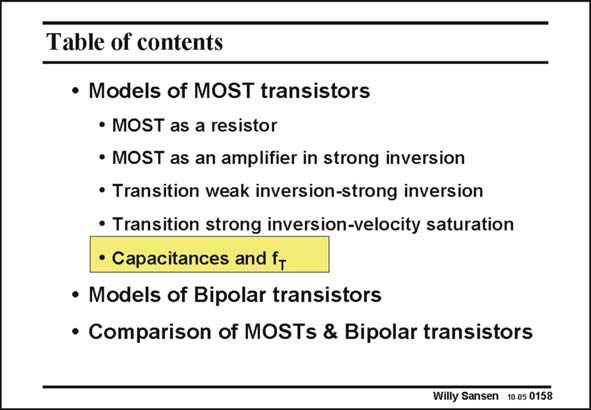

# SANSEN-0158 · Table of contents

章节：01 MOS 晶体管与双极型晶体管的比较  
PDF 页：31；书本页：31；幻灯片编号：0158  
状态：unreviewed



## 对应教材讲解

### PDF 31 · 书本 31

At high frequencies, capacitances play a role. First, we identify all possible capacitances present in MOST devices. We then take them together into terminal capacitances. Finally, we have a look at the parameter f which is a T kind of a high frequency limit beyond which a MOST cannot provide gain. Again we will try to find an expression of f in all three T regions, weak inversion, strong inversion and velocity saturation.

## 公式／性能结论候选摘录

以下为规则截取的原文，尚未逐项判读。

- PDF 31: Finally, we have a look at the parameter f which is a T kind of a high frequency limit beyond which a MOST cannot provide gain.

## 曲线结论候选摘录

以下为规则截取的原文，尚未逐项判读。

（未由规则找到；不代表原页没有此类内容。）

## 原文条件与近似候选摘录

以下为规则截取的原文，尚未逐项判读。

- PDF 31: Again we will try to find an expression of f in all three T regions, weak inversion, strong inversion and velocity saturation.

## 幻灯片 OCR（未校正）

```text
Table of contents
• Models of MOST transistors
• MOST as a resistor
• MOST as an amplifier in strong inversion
• Transition weak inversion-strong inversion
• Transition strong inversion-velocity saturation
• Capacitances and fr
• Models of Bipolar transistors
• Comparison of MOSTs & Bipolar transistors
Willy Sansen 10.05 0158
```

数学上下标、分数及正负号以原图为准。电路图已保留；未核对的连接不输出成可仿真 netlist。
