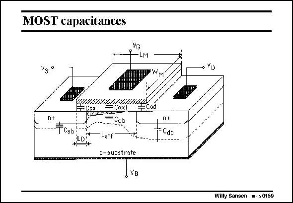

# SANSEN-0159 · MOST capacitances

章节：01 MOS 晶体管与双极型晶体管的比较  
PDF 页：32；书本页：32；幻灯片编号：0159  
状态：unreviewed



## 对应教材讲解

### PDF 31 · 书本 31

The most important capacitances are shown on this cross-section. The Gate oxide capacitance C is the most important one as it controls the transistor current. oxt

### PDF 32 · 书本 32

The total oxide capacitance C equals about WL C . oxt ox It overlaps both the Source and the Drain and causes overlap capacitances Cos and Cod respectively. The channel has a depletion layer (or junction) capacitance to the substrate C . It now depends on the cb voltage across it. Both Source and Drain regions have depletion capacitances C and C to sb db the substrate as well. All capacitances are now described in detail.

## 公式／性能结论候选摘录

以下为规则截取的原文，尚未逐项判读。

- PDF 32: The total oxide capacitance C equals about WL C . oxt ox It overlaps both the Source and the Drain and causes overlap capacitances Cos and Cod respectively.
- PDF 32: It now depends on the cb voltage across it.

## 曲线结论候选摘录

以下为规则截取的原文，尚未逐项判读。

（未由规则找到；不代表原页没有此类内容。）

## 原文条件与近似候选摘录

以下为规则截取的原文，尚未逐项判读。

（未由规则找到；不代表原页没有此类内容。）

## 幻灯片 OCR（未校正）

```text
MOST capacitances
LM
n+
Tisb!
LD
-Cdb
•Lett
P-susstrate
• YD
Willy Sansen 1Hs 0159
```

数学上下标、分数及正负号以原图为准。电路图已保留；未核对的连接不输出成可仿真 netlist。
