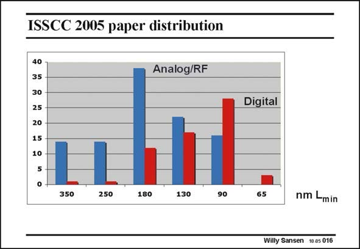

# SANSEN-016 · ISSCC 2005 paper distribution

章节：01 MOS 晶体管与双极型晶体管的比较  
PDF 页：4；书本页：4；幻灯片编号：016  
状态：unreviewed



## 对应教材讲解

### PDF 4 · 书本 4

Which are the most used channel lengths today? To explore this, the number of papers is shown of the last IEEE ISSCC conference (held at San Francisco in February) for two categories, the digital circuits and the analog or RF circuits. It is clear that the digital circuits peak at 90 nm channel length, whereas the analog ones lag behind by two generations; they peak at about 180 nm.

## 公式／性能结论候选摘录

以下为规则截取的原文，尚未逐项判读。

（未由规则找到；不代表原页没有此类内容。）

## 曲线结论候选摘录

以下为规则截取的原文，尚未逐项判读。

- PDF 4: It is clear that the digital circuits peak at 90 nm channel length, whereas the analog ones lag behind by two generations; they peak at about 180 nm.

## 原文条件与近似候选摘录

以下为规则截取的原文，尚未逐项判读。

（未由规则找到；不代表原页没有此类内容。）

## 幻灯片 OCR（未校正）

```text
ISSCC 2005 paper distribution
40 1
35
30
25
20
15
10
5
Analog/RF
350
250
180
130
90
Digital
65
nm Lmin
Willy Sansen 10.05 016
```

数学上下标、分数及正负号以原图为准。电路图已保留；未核对的连接不输出成可仿真 netlist。
