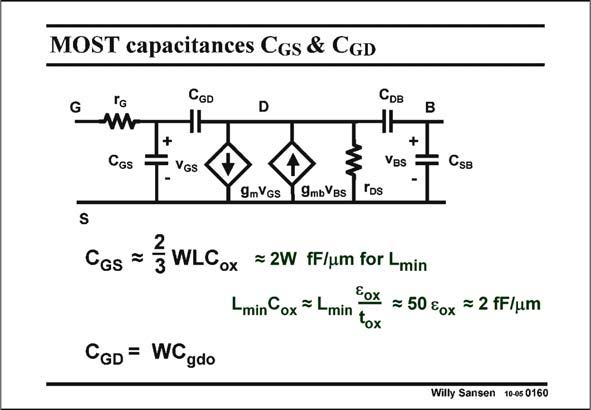

# SANSEN-0160 · MOST capacitances CGs & CGD

章节：01 MOS 晶体管与双极型晶体管的比较  
PDF 页：32；书本页：32；幻灯片编号：0160  
状态：unreviewed



## 对应教材讲解

### PDF 32 · 书本 32

The Gate-Source capacitance C includes the oxide GS capacitance C and the oxt Gate-Source overlap capacitance C . It is usually gso taken to be only the C oxt itself, which is a good average value as it is somewhat overestimated but also somewhat underestimated. It is overestimated because the Gate-Source capacitance C is actually GS only about 2/3 of C oxt [Ref. Tsividis]. Indeed the channel has vanished at the Drain side. Electric-field calculations have shown that a reduction of the C by a factor 2/3 is oxt about right. The Gate-Source capacitance C is also underestimated because it must include the Gate- GS Source overlap capacitance C . This is normally only a fraction (20–25%) of C . gso oxt Taking just C =WL C is thus a good estimate. It is clear that CAD models provide more oxt ox accurate values for these capacitances. These simple ones are good enough for hand calculations. If a minimum channel length L is used, then the C can easily be estimated to be only min GS 2W, in fF, in which W is in micrometer. Indeed the oxide thickness t of standard CMOS ox processes is very close to L/50. The expression of C can thus be simplified to 2W. GS This shows that the input capacitance C of a MOST only depends on its width, at least if GS the minimum channel length is always used.

### PDF 33 · 书本 33

This rule of thumb will be used quite often to calculate parasitic capacitances in opamps (see Chapter 6).

## 公式／性能结论候选摘录

以下为规则截取的原文，尚未逐项判读。

- PDF 32: This is normally only a fraction (20–25%) of C . gso oxt Taking just C =WL C is thus a good estimate.
- PDF 32: The expression of C can thus be simplified to 2W.
- PDF 32: GS This shows that the input capacitance C of a MOST only depends on its width, at least if GS the minimum channel length is always used.

## 曲线结论候选摘录

以下为规则截取的原文，尚未逐项判读。

（未由规则找到；不代表原页没有此类内容。）

## 原文条件与近似候选摘录

以下为规则截取的原文，尚未逐项判读。

（未由规则找到；不代表原页没有此类内容。）

## 幻灯片 OCR（未校正）

```text
MOST capacitances CGs & CGD
CGD
G
D
Срв
B
Cgs
VGS
Ves
• С'sв.
gmVgs
9mbVBs
Tps
Cos = 3 WLGox =2W fF/um for Lmin
Lmin Cox = Lmin
Cox = 50 €0x = 2 fF/um
tox
CcD = WCgdo
Willy Sansen 10-0s 0160
```

数学上下标、分数及正负号以原图为准。电路图已保留；未核对的连接不输出成可仿真 netlist。
