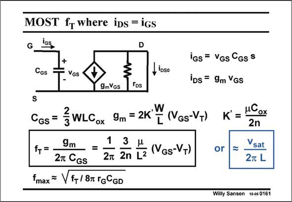

# SANSEN-0161 · MOST f where iDs = iGs

章节：01 MOS 晶体管与双极型晶体管的比较  
PDF 页：33；书本页：33；幻灯片编号：0161  
状态：unreviewed



## 对应教材讲解

### PDF 33 · 书本 33

Parameter f is the fre- T quency for which the output current i , though a short, DS equals the input current i . GS It is determined by the time constant of C and the GS transconductance g . m This parameter is a kind of Figure-of-merit for high frequency performance, taking into account only the intrinsic transistor parameters. Substitution of C and GS g in f shows that this frem T quency is proportional to V −V and inversely proportional to L2. Decreasing the channel length allows an higher GS T frequency performance indeed. In velocity saturation however, the time that the electrons need to cross the channel length is L/v . The frequency f in velocity saturation is, to put it simply v /2pL. This is the highest sat T sat frequency that can be obtained with a MOST. It is obviously obtained for high values of V −V . It does not increase with smaller L2 however, but only with L. GS T Another figure-of-merit exists which includes some more extrinsic parameters. It is the maximum frequency of oscillation f . It is obviously related to f but includes parameters such as the Gate max T series resistance r and the Gate-Drain capacitance C . It can be higher or lower than f . G GD T

## 公式／性能结论候选摘录

以下为规则截取的原文，尚未逐项判读。

- PDF 33: Parameter f is the fre- T quency for which the output current i , though a short, DS equals the input current i .
- PDF 33: Substitution of C and GS g in f shows that this frem T quency is proportional to V −V and inversely proportional to L2.
- PDF 33: It does not increase with smaller L2 however, but only with L.

## 曲线结论候选摘录

以下为规则截取的原文，尚未逐项判读。

（未由规则找到；不代表原页没有此类内容。）

## 原文条件与近似候选摘录

以下为规则截取的原文，尚未逐项判读。

- PDF 33: In velocity saturation however, the time that the electrons need to cross the channel length is L/v .
- PDF 33: The frequency f in velocity saturation is, to put it simply v /2pL.

## 幻灯片 OCR（未校正）

```text
MOST f where iDs = iGs
G
ios
CGs
+
= VGs
, Ioso
iGs = Vgs Cgss
iDs = 9m Vgs
9mVGs
Tps
S
CGs =
}WLCox
, W
9m = 2K
[ (NGs-VT)
9m
1
3
fT=-
-=
2T CGS
2m 2n L2
(VGs-VT)
Fmax ~ Vf+/ 8T TGCGD
or
K° = 1Cox
2n
Vsat
2m L
Wiily Sansen 1005 0161
```

数学上下标、分数及正负号以原图为准。电路图已保留；未核对的连接不输出成可仿真 netlist。
