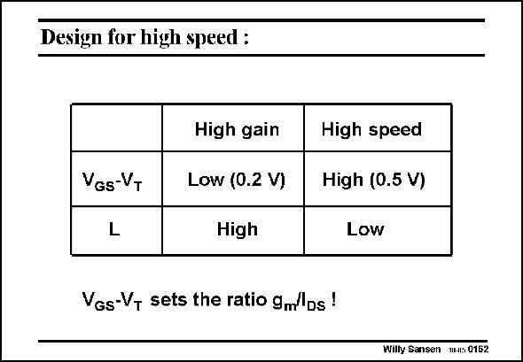

# SANSEN-0162 · Design for high speed :

章节：01 MOS 晶体管与双极型晶体管的比较  
PDF 页：33；书本页：33；幻灯片编号：0162  
状态：unreviewed



## 对应教材讲解

### PDF 33 · 书本 33

It is striking that for highfrequency design, a large V −V is required and the GS T lowest possible value of channel length L. This is exactly the opposite of what is required for high gain (and later low noise and offset). This is probably one of the most basic compromises in analog CMOS design. High-gain devices such as at the input of operational amplifiers, have to be designed for small V −V GS T

### PDF 34 · 书本 34

and for large channel length L. For high frequency designs, such as VCO’s and LNA’s, it is exactly the opposite. Remember that setting the values of V −V is the same as setting the ratio of g /I or the GS T m DS same as setting the inversion coefficient i=I /I . DS DSt

## 公式／性能结论候选摘录

以下为规则截取的原文，尚未逐项判读。

- PDF 33: This is exactly the opposite of what is required for high gain (and later low noise and offset).
- PDF 33: High-gain devices such as at the input of operational amplifiers, have to be designed for small V −V GS T

## 曲线结论候选摘录

以下为规则截取的原文，尚未逐项判读。

（未由规则找到；不代表原页没有此类内容。）

## 原文条件与近似候选摘录

以下为规则截取的原文，尚未逐项判读。

（未由规则找到；不代表原页没有此类内容。）

## 幻灯片 OCR（未校正）

```text
Design for high speed :
VGs-VT
L
High gain
Low (0.2 V)
High
Vgs-V, sets the ratio gm/'Ds!
High speed
High (0.5 V)
Low
Wilty Sansen W-s 0162
```

数学上下标、分数及正负号以原图为准。电路图已保留；未核对的连接不输出成可仿真 netlist。
