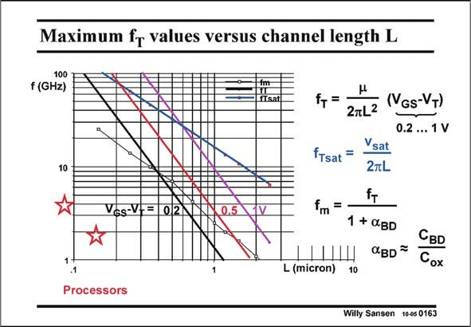

# SANSEN-0163 · Maximum fr values versus channel length L

章节：01 MOS 晶体管与双极型晶体管的比较  
PDF 页：34；书本页：34；幻灯片编号：0163  
状态：unreviewed



## 对应教材讲解

### PDF 34 · 书本 34

For a specific V −V , the GS T frequencies f are easily plot- T ted versus channel length L, as shown in this slide. The one for velocity saturation is independent of V −V but GS T has a lower slope. The frequencies f for sat- T uration is in blue; the ones in strong inversion are for V =0.2 V in black, for GST V =0.5 V in red, and for GST V =1 V in magenta. GST It is striking to see that f T values in this slide 100 GHz are readily available, at least for CMOS processes with channel lengths below 0.13 mm. Note also that from this technology, velocity saturation dominates even for V −V values of only 0.2 V. GS T For V =0.2 V, the crossover is somewhere below 90 nm channel length. For high-frequency GST applications however, in which V =0.5 V or higher, the crossover value in L is about 0.25 mm. GST For hand calculations, we need a model for f that encompasses both the strong-inversion T region and the velocity-saturation region. This is given next. Note, however, that some experimental upper frequencies are added of VCO’s and LNA’s. They are on a curve labeled f , which are about 1/5 of f . Also some clock frequencies are max T added for some present-day microprocessors. They are at about 1/100 of f ! T

## 公式／性能结论候选摘录

以下为规则截取的原文，尚未逐项判读。

- PDF 34: The one for velocity saturation is independent of V −V but GS T has a lower slope.

## 曲线结论候选摘录

以下为规则截取的原文，尚未逐项判读。

- PDF 34: For a specific V −V , the GS T frequencies f are easily plot- T ted versus channel length L, as shown in this slide.
- PDF 34: The one for velocity saturation is independent of V −V but GS T has a lower slope.
- PDF 34: They are on a curve labeled f , which are about 1/5 of f .

## 原文条件与近似候选摘录

以下为规则截取的原文，尚未逐项判读。

- PDF 34: The one for velocity saturation is independent of V −V but GS T has a lower slope.
- PDF 34: Note also that from this technology, velocity saturation dominates even for V −V values of only 0.2 V.
- PDF 34: GST For hand calculations, we need a model for f that encompasses both the strong-inversion T region and the velocity-saturation region.

## 幻灯片 OCR（未校正）

```text
Maximum fr values versus channel length L
100
f (GHz)
10
VGs-V-= 0|2
0.5
f+=
2mL2
fTsat =
fm
=
Ysat
2TL
fT
1 + aBD
OBD
(VGs-VT)
0.2 ... 1 V
L (micron)
CBD
Cox
10
Processors
Willy Sansen 10-05 0163
```

数学上下标、分数及正负号以原图为准。电路图已保留；未核对的连接不输出成可仿真 netlist。
