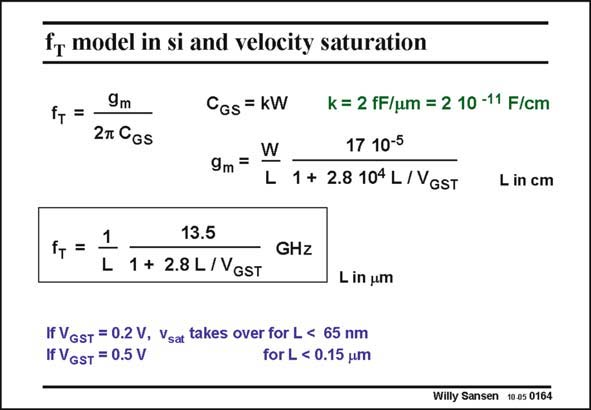

# SANSEN-0164 · fr model in si and velocity saturation

章节：01 MOS 晶体管与双极型晶体管的比较  
PDF 页：35；书本页：35；幻灯片编号：0164  
状态：unreviewed



## 对应教材讲解

### PDF 34 · 书本 34

A simple model for f which spans both regions of operation, the strong-inversion and the T velocity-saturation region, is simply obtained by substitution of the transconductance g by its m expression covering both regions. Also C can be substituted by 2W. GS The resulting expression is a useful tool to predict high-frequency performance. It will be used in many later Chapters to establish upper limits of frequency performance. Obviously, the transition values of channel length L, for specific values of V −V are the GS T same as for the transconductance g . For V −V =0.2 V, channel lengths below 65 nm provide m GS T operation fully in velocity saturation.

## 公式／性能结论候选摘录

以下为规则截取的原文，尚未逐项判读。

- PDF 34: It will be used in many later Chapters to establish upper limits of frequency performance.

## 曲线结论候选摘录

以下为规则截取的原文，尚未逐项判读。

（未由规则找到；不代表原页没有此类内容。）

## 原文条件与近似候选摘录

以下为规则截取的原文，尚未逐项判读。

- PDF 34: A simple model for f which spans both regions of operation, the strong-inversion and the T velocity-saturation region, is simply obtained by substitution of the transconductance g by its m expression covering both regions.
- PDF 34: For V −V =0.2 V, channel lengths below 65 nm provide m GS T operation fully in velocity saturation.

## 幻灯片 OCR（未校正）

```text
fr model in si and velocity saturation
f, =
9m
2n CGs
CGs = KW
9m =
L
k = 2 fF/um = 2 10 -11 F/cm
17 10-5
1 + 2.8 104 L/VGST
L in cm
f, =
1
L
13.5
1 + 2.8 L/VGST
GHZ
L in um
If VGST
= 0.2 V, Vsat takes over for L < 65 nm
If VGST = 0.5 V
for L < 0.15 um
Willy Sansen 10.05 0164
```

数学上下标、分数及正负号以原图为准。电路图已保留；未核对的连接不输出成可仿真 netlist。
