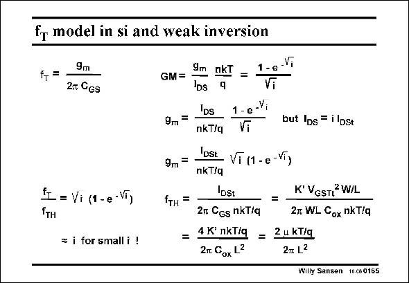

# SANSEN-0165 · fr model in si and weak inversion

章节：01 MOS 晶体管与双极型晶体管的比较  
PDF 页：35；书本页：35；幻灯片编号：0165  
状态：unreviewed



## 对应教材讲解

### PDF 35 · 书本 35

At low currents, the absolute values of the transconductance g are low, m yielding low values for frequency f as well. The ques- T tion is, what absolute values of f can actually be T obtained for MOSTs in weak inversion? A simple model for f T which spans the weak-inversion and the strong-inversion region, is again obtained by substitution of the transconductance g by m its expression covering both regions. At high currents (for which this model is actually not valid as the effect of velocity saturation is not included), the highest value of f is reached, which is √i f . The lower the current (or the T TH inversion coefficient), the lower f is, as plotted versus inversion coefficient. T Indeed for very small values of i, f equals about i f . T TH Note however, that reference frequency f increases with L−2 and can now reach very TH attractive values.

## 公式／性能结论候选摘录

以下为规则截取的原文，尚未逐项判读。

- PDF 35: T Indeed for very small values of i, f equals about i f .
- PDF 35: T TH Note however, that reference frequency f increases with L−2 and can now reach very TH attractive values.

## 曲线结论候选摘录

以下为规则截取的原文，尚未逐项判读。

- PDF 35: The lower the current (or the T TH inversion coefficient), the lower f is, as plotted versus inversion coefficient.

## 原文条件与近似候选摘录

以下为规则截取的原文，尚未逐项判读。

- PDF 35: At high currents (for which this model is actually not valid as the effect of velocity saturation is not included), the highest value of f is reached, which is √i f .

## 幻灯片 OCR（未校正）

```text
fr model in si and weak inversion
fT=
9m
2T GGs
= Vi (1 -e -VT)
= i for small i !
GM=
9m =
9m=
fтн =
9m nkT
=
DS
IDs
nkT/q
1 - e
Vi
but lps = i lbst
IDSt
Vĩ (1 - e -VT)
nkT/q
DSt
K' VGSTi W/L
2m CGs nkT/q
27 WL Cox nkT/q
= 4K° nkT/q =
Zu kT/g
2n Gox L2
2 L2
Willy Sansen 10%60165
```

数学上下标、分数及正负号以原图为准。电路图已保留；未核对的连接不输出成可仿真 netlist。
