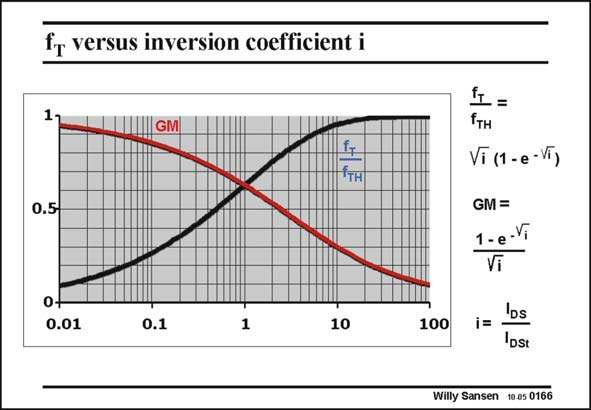

# SANSEN-0166 · fr versus inversion coefficient i

章节：01 MOS 晶体管与双极型晶体管的比较  
PDF 页：36；书本页：36；幻灯片编号：0166  
状态：unreviewed



## 对应教材讲解

### PDF 35 · 书本 35

Both parameters GM (which is g /I normalized to nkT/q) and f (normalized to f ) are m DS T TH shown versus inversion coefficient i. For weak inversion the g /I ratio is high but the f is low. m DS T

### PDF 36 · 书本 36

The gain-speed compromise is very well illustrated by this curve! However, for deep weakinversion (i=0.01) the f T value has dropped to only about 10%. If a transistor is taken with 130 nm channel length, with an f of about T 100 GHz, its resulting f is T still about 10 GHz! In other words, very reasonable high-frequency performance is possible in weak inversion, provided nanometer CMOS is available.

## 公式／性能结论候选摘录

以下为规则截取的原文，尚未逐项判读。

- PDF 36: The gain-speed compromise is very well illustrated by this curve!

## 曲线结论候选摘录

以下为规则截取的原文，尚未逐项判读。

- PDF 36: The gain-speed compromise is very well illustrated by this curve!

## 原文条件与近似候选摘录

以下为规则截取的原文，尚未逐项判读。

- PDF 36: In other words, very reasonable high-frequency performance is possible in weak inversion, provided nanometer CMOS is available.

## 幻灯片 OCR（未校正）

```text
fr versus inversion coefficient i
1
GM|
0.5-
i1 =
fтн
Vi (1 - e -Vĩ)
GM =
1-e-V
Vi
0+
0.01
0.1
1
10
100
i=
IDs
DSt
Willy Sansen 10.05 0166
```

数学上下标、分数及正负号以原图为准。电路图已保留；未核对的连接不输出成可仿真 netlist。
