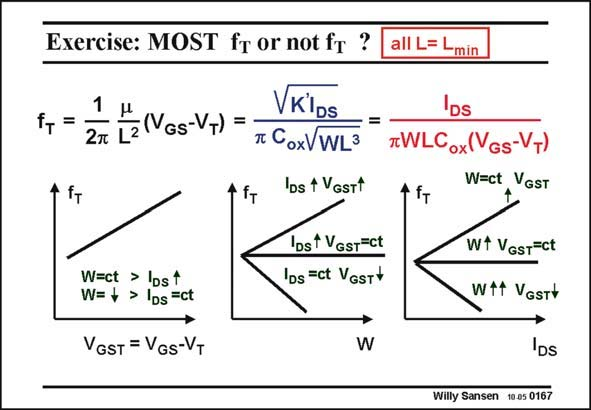

# SANSEN-0167 · Exercise: MOST fr or not ft ? all L= Lmin

章节：01 MOS 晶体管与双极型晶体管的比较  
PDF 页：36；书本页：36；幻灯片编号：0167  
状态：unreviewed



## 对应教材讲解

### PDF 36 · 书本 36

As an exercise, let us try to find out whether the frequency f increases or T decreases with current. Substitution of the V − GS V brings in the width W T and length L of the transistor. Various different expressions can now be obtained. The most important one is probably the last one, which shows that an answer to this question can only be obtained, provided one more parameter is fixed. Indeed, if V −V is GS T fixed, then frequency f increases with the current. If however, the V −V is decreased accord- T GS T ingly, then the f does not change with the current. It is even possible to decrease the V −V T GS T in such a way that frequency f decreases with increasing current. T This conclusion has been reached before. In a MOST transistor it is never possible to find out how one parameter changes with respect to one other one. Another parameter always has to be fixed. Indeed, a MOST has two degrees of freedom. Normally V −V (or inversion GS T coefficient) and L are chosen by the designer, setting all other parameters.

## 公式／性能结论候选摘录

以下为规则截取的原文，尚未逐项判读。

- PDF 36: As an exercise, let us try to find out whether the frequency f increases or T decreases with current.
- PDF 36: Indeed, if V −V is GS T fixed, then frequency f increases with the current.
- PDF 36: If however, the V −V is decreased accord- T GS T ingly, then the f does not change with the current.
- PDF 36: It is even possible to decrease the V −V T GS T in such a way that frequency f decreases with increasing current.
- PDF 36: T This conclusion has been reached before.

## 曲线结论候选摘录

以下为规则截取的原文，尚未逐项判读。

（未由规则找到；不代表原页没有此类内容。）

## 原文条件与近似候选摘录

以下为规则截取的原文，尚未逐项判读。

- PDF 36: The most important one is probably the last one, which shows that an answer to this question can only be obtained, provided one more parameter is fixed.

## 幻灯片 OCR（未校正）

```text
Exercise: MOST fr or not ft ?
1
f, =
27 [2(Vos-VT)
=
VKiDs
* CoxVWL3
4
IDs 1 VGsTt
TIT
IDst VGsT=ct
Ibs =ct VGsT™
all L= Lmin
DS
*WLCox(VGs-VT)
W=ct VGST
+ f+
W=ct > lDst
W= + > IDs =ct
VGST = VGs-VT
W
Wf VGsT=ct
Wtf VGsTv
DS
Willy Sansen 10.05 0167
```

数学上下标、分数及正负号以原图为准。电路图已保留；未核对的连接不输出成可仿真 netlist。
