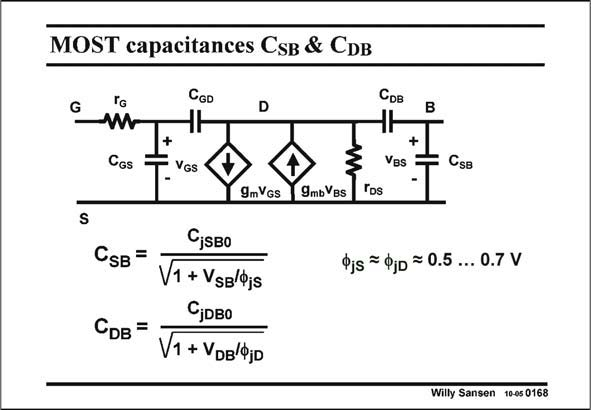

# SANSEN-0168 · MOST capacitances CsB & CDB

章节：01 MOS 晶体管与双极型晶体管的比较  
PDF 页：37；书本页：37；幻灯片编号：0168  
状态：unreviewed



## 对应教材讲解

### PDF 37 · 书本 37

Both islands, the Source and the Drain, have a junction capacitance with respect to the bulk (or substrate). They can easily be added to the small-signal diagram as shown in this slide. Junction capacitances normally show a voltage dependence described by a square root, when they are reverse biased. The most important one is doubtless the Drain-Bulk capacitance C as it DB appears at the output of the MOST amplifier. The Source-Bulk capacitance C is normally shorted SB out.

## 公式／性能结论候选摘录

以下为规则截取的原文，尚未逐项判读。

- PDF 37: Junction capacitances normally show a voltage dependence described by a square root, when they are reverse biased.

## 曲线结论候选摘录

以下为规则截取的原文，尚未逐项判读。

（未由规则找到；不代表原页没有此类内容。）

## 原文条件与近似候选摘录

以下为规则截取的原文，尚未逐项判读。

（未由规则找到；不代表原页没有此类内容。）

## 幻灯片 OCR（未校正）

```text
MOST capacitances CsB & CDB
CGD
G
D
Срв
B
CGs
+
Ves
CsB
9mVGs
9mbVBs
Tps
CjsBo
Сsв =
V1 + Vss/js
CjDBo
СDв =
V1 + VDB/ФjD
Pjs = Qjo = 0.5 ... 0.7 V
Willy Sansen 10-0s 0168
```

数学上下标、分数及正负号以原图为准。电路图已保留；未核对的连接不输出成可仿真 netlist。
