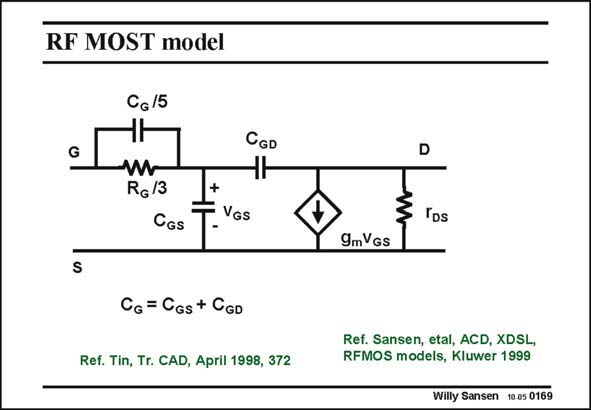

# SANSEN-0169 · RF MOST model

章节：01 MOS 晶体管与双极型晶体管的比较  
PDF 页：37；书本页：37；幻灯片编号：0169  
状态：unreviewed



## 对应教材讲解

### PDF 37 · 书本 37

At very high frequencies, for example beyond f /3, the T input impedance cannot be modeled by a simple Gate resistor R and input G capacitances C and C . GS GD It can be corrected by a small capacitance shunting resistor R . This capaci- G tance is normally obtained by fitting the measured input impedance, obtained from s-parameters, to the model. This usually leads to a reduction of the Gate resistor R (here to 1/3) G and a shunt capacitor, which is a fraction (here 1/5) of the input capacitance. These are obviously fitting measurements. They can vary from designer to designer depending on the actual frequency range used. Remember that this additional shunt capacitance is only required for the highest frequency range. Only designs of high-frequency VCO’s and LNA’s may require this.

## 公式／性能结论候选摘录

以下为规则截取的原文，尚未逐项判读。

- PDF 37: They can vary from designer to designer depending on the actual frequency range used.

## 曲线结论候选摘录

以下为规则截取的原文，尚未逐项判读。

（未由规则找到；不代表原页没有此类内容。）

## 原文条件与近似候选摘录

以下为规则截取的原文，尚未逐项判读。

（未由规则找到；不代表原页没有此类内容。）

## 幻灯片 OCR（未校正）

```text
RF MOST model
G
CG/5
ЧF
RG/3
CGs
CGD
+
- VGs
CG = CGs + CGD
Ref. Tin, Tr. CAD, April 1998, 372
D
3 IDs
9mVGS
Ref. Sansen, etal, ACD, XDSL,
RFMOS models, Kluwer 1999
Willy Sansen 1005 0169
```

数学上下标、分数及正负号以原图为准。电路图已保留；未核对的连接不输出成可仿真 netlist。
