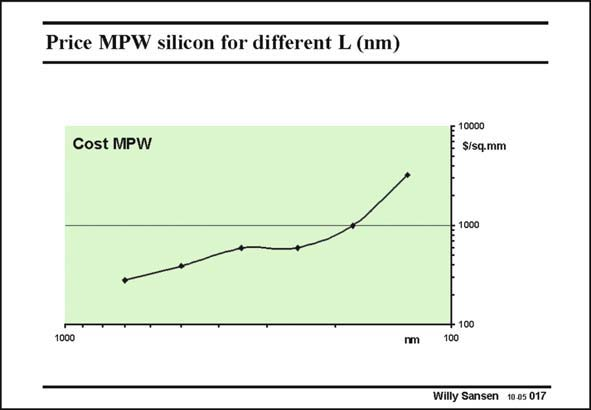

# SANSEN-017 · Price MPW silicon for different L (nm)

章节：01 MOS 晶体管与双极型晶体管的比较  
PDF 页：4；书本页：4；幻灯片编号：017  
状态：unreviewed



## 对应教材讲解

### PDF 4 · 书本 4

Indeed for small quantities, silicon foundries offer silicon at higher cost if the channel lengths are smaller. This is clearly illustrated by this cost of a Multi Project Wafer chip versus channel length. In such a MPW run, many designs are assembled and put together in one single mask and run. As a result the total cost is divided over all participants of this run. This has been the source of cheap silicon for many universities and fabless design centers. The cost in $/mm2 is reasonable up to about 0.18 mm. From 0.13 mm on the cost increases dramatically, depriving many universities from cheap silicon. What the cost will be of 90 nm and 65 nm is easily found by extrapolation! This shows very clearly that a crisis is at hand!

## 公式／性能结论候选摘录

以下为规则截取的原文，尚未逐项判读。

- PDF 4: As a result the total cost is divided over all participants of this run.
- PDF 4: From 0.13 mm on the cost increases dramatically, depriving many universities from cheap silicon.

## 曲线结论候选摘录

以下为规则截取的原文，尚未逐项判读。

（未由规则找到；不代表原页没有此类内容。）

## 原文条件与近似候选摘录

以下为规则截取的原文，尚未逐项判读。

（未由规则找到；不代表原页没有此类内容。）

## 幻灯片 OCR（未校正）

```text
Price MPW silicon for different L (nm)
Cost MPW
= 1000
1000
nm
• 100
100
Willy Sansen 10.05 017
```

数学上下标、分数及正负号以原图为准。电路图已保留；未核对的连接不输出成可仿真 netlist。
