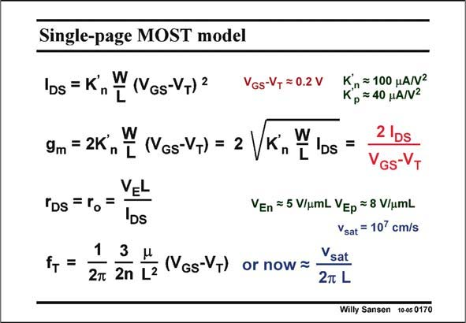

# SANSEN-0170 · Single-page MOST model

章节：01 MOS 晶体管与双极型晶体管的比较  
PDF 页：38；书本页：38；幻灯片编号：0170  
状态：unreviewed



## 对应教材讲解

### PDF 38 · 书本 38

As a conclusion, a summary is given of the model parameters which will be used throughout this text. As they fit on one page, they are called the single-page MOST model. It is suggested to know these simple expressions by heart. This will not be very difficult as they will be used many times.

## 公式／性能结论候选摘录

以下为规则截取的原文，尚未逐项判读。

- PDF 38: As a conclusion, a summary is given of the model parameters which will be used throughout this text.

## 曲线结论候选摘录

以下为规则截取的原文，尚未逐项判读。

（未由规则找到；不代表原页没有此类内容。）

## 原文条件与近似候选摘录

以下为规则截取的原文，尚未逐项判读。

（未由规则找到；不代表原页没有此类内容。）

## 幻灯片 OCR（未校正）

```text
Single-page MOST model
IDs = K
n
W(VGs-VT) 2
9m = 2K, Y (VGs-V+) =
Tos =ro=VEL
1
3
f+ =
2m 2n L2
(VGs-VT)
VGS-VT = 0.2 V
Kn = 100 HANN2
Kp=40 HAN2
W
n
L
Ds =
2 |Ds
VGS-VT
VEn = 5 V/umL VEp = 8 V/umL
Vsat = 107 cm/s
Vsat
or now =
2m L
Willy Sansen 10-05 0170
```

数学上下标、分数及正负号以原图为准。电路图已保留；未核对的连接不输出成可仿真 netlist。
