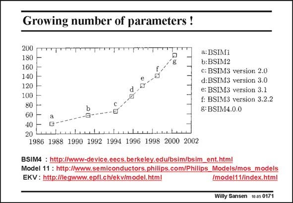

# SANSEN-0171 · Growing number of parameters !

章节：01 MOS 晶体管与双极型晶体管的比较  
PDF 页：38；书本页：38；幻灯片编号：0171  
状态：unreviewed



## 对应教材讲解

### PDF 38 · 书本 38

Several more elaborate and precise models are being used. The three most used ones are probably the BSIM models, the Philips models and the EKV models. References are given on all of them. It is striking however, that the number of model parameters seems to increase all the time. A curve is given for the BSIM model. This is a result of the addition of corrections on a corrected parameter, starting with a simple model in strong inversion. As a result, the number of parameters explodes. A new approach has been taken in the EKV model, where a model in strong and weak inversion is introduced with less model parameters. The total number of parameters is then less as well. Ultimately, it is the standardization of the model that is of primordial importance. The model that is most used is the most important one, whatever the quality is of that model.

## 公式／性能结论候选摘录

以下为规则截取的原文，尚未逐项判读。

- PDF 38: It is striking however, that the number of model parameters seems to increase all the time.
- PDF 38: As a result, the number of parameters explodes.

## 曲线结论候选摘录

以下为规则截取的原文，尚未逐项判读。

- PDF 38: A curve is given for the BSIM model.

## 原文条件与近似候选摘录

以下为规则截取的原文，尚未逐项判读。

（未由规则找到；不代表原页没有此类内容。）

## 幻灯片 OCR（未校正）

```text
Growing number of parameters !
200
180
160
140
120
100
80
b
60
40
20
antan baslesataeeees
1986 1988 1990 1992 1994 1996 1998 2000 2002
a: BSIM1
b:BSIM2
c: BSIM3 version 2.0
d: BSIM3 version 3.0
e: BSIM3 version 3.1
f: BSIM3 version 3.2.2
g: BSIM4.0.0
BSIM4 : http://www-device.eecs.berkeley.edu/bsim/bsim_ent.html
Model 11 : http://www.semiconductors.philips.com/Philips_Models/mos_models
EKV: http://legwww.epfl.ch/ekv/model.html
Imodel11/index.html
Willy Sansen 10.05 0171
```

数学上下标、分数及正负号以原图为准。电路图已保留；未核对的连接不输出成可仿真 netlist。
