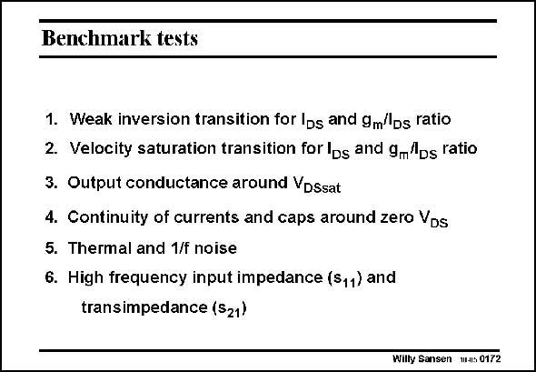

# SANSEN-0172 · Benchmark tests

章节：01 MOS 晶体管与双极型晶体管的比较  
PDF 页：39；书本页：39；幻灯片编号：0172  
状态：unreviewed



## 对应教材讲解

### PDF 38 · 书本 38

If a new model is being used, it is wise to check a few weaknesses which used to be around in older models. A short list is given in the slide.

### PDF 39 · 书本 39

The two transition points on either side of the stronginversion region must be checked. This means that we have to have a look at the continuity of the current itself and its first derivative. Also the second and third derivative must be continuous if we are interested in distortion (see Chapter 18). Continuity must also be ensured of the current and its first derivative at all transition points for the voltage applied. They are – transition between linear and saturation region (for increasing v ) DS – transition around zero v DS The models must also be verified if noise models are used. Finally, for high-frequency design, the input impedance (derived from parameter s ) and the 11 gain (from s ) had better be verified versus frequency. Of course the other two s parameters 21 can be added as well.

## 公式／性能结论候选摘录

以下为规则截取的原文，尚未逐项判读。

- PDF 39: Finally, for high-frequency design, the input impedance (derived from parameter s ) and the 11 gain (from s ) had better be verified versus frequency.

## 曲线结论候选摘录

以下为规则截取的原文，尚未逐项判读。

（未由规则找到；不代表原页没有此类内容。）

## 原文条件与近似候选摘录

以下为规则截取的原文，尚未逐项判读。

- PDF 39: They are – transition between linear and saturation region (for increasing v ) DS – transition around zero v DS The models must also be verified if noise models are used.

## 幻灯片 OCR（未校正）

```text
Benchmark tests
1. Weak inversion transition for Ibs and gm/lbs ratio
2. Velocity saturation transition for lds and gm"ps ratio
3. Output conductance around VDSsat
4. Continuity of currents and caps around zero Vps
5. Thermal and 1/f noise
6. High frequency input impedance (S11) and
transimpedance (S21)
Willy Sansen 1HS 0172
```

数学上下标、分数及正负号以原图为准。电路图已保留；未核对的连接不输出成可仿真 netlist。
