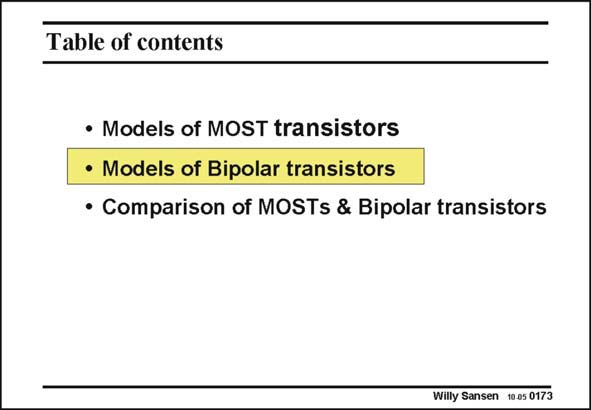

# SANSEN-0173 · Table of contents

章节：01 MOS 晶体管与双极型晶体管的比较  
PDF 页：39；书本页：39；幻灯片编号：0173  
状态：unreviewed



## 对应教材讲解

### PDF 39 · 书本 39

Considerable attention has been paid up till now to models of MOST devices, despite the fact that the bipolar transistors are historically first. Bipolar transistors are easily found nowadays in BiCMOS processes in which MOST devices and bipolar transistors are integrated together. We will have a look at models for bipolar transistors first, and carry out a comparison in performance afterwards.

## 公式／性能结论候选摘录

以下为规则截取的原文，尚未逐项判读。

（未由规则找到；不代表原页没有此类内容。）

## 曲线结论候选摘录

以下为规则截取的原文，尚未逐项判读。

（未由规则找到；不代表原页没有此类内容。）

## 原文条件与近似候选摘录

以下为规则截取的原文，尚未逐项判读。

（未由规则找到；不代表原页没有此类内容。）

## 幻灯片 OCR（未校正）

```text
Table of contents
• Models of MOST transistors
• Models of Bipolar transistors
• Comparison of MOSTs & Bipolar transistors
Willy Sansen 10-05 0173
```

数学上下标、分数及正负号以原图为准。电路图已保留；未核对的连接不输出成可仿真 netlist。
