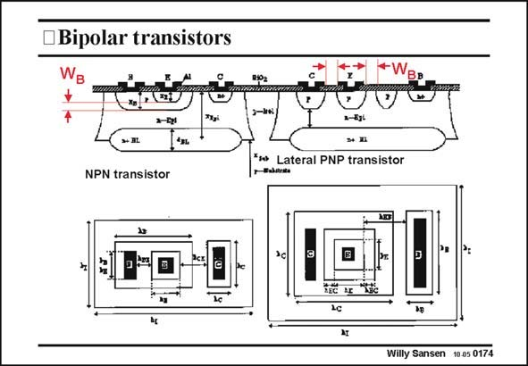

# SANSEN-0174 · • Bipolar transistors

章节：01 MOS 晶体管与双极型晶体管的比较  
PDF 页：40；书本页：40；幻灯片编号：0174  
状态：unreviewed



## 对应教材讲解

### PDF 39 · 书本 39

A bipolar transistor consists of two diodes back to back, very close together. The first one is forward biased, whereas the other one reverse biased. It is a device which is very different from

### PDF 40 · 书本 40

a MOST as it is actually two diodes, rather than a resistor. The two diodes are easily recognized in the vertical npn transistor on the left. In this structure, a p-region is diffused in the n-epitaxial layer (called Collector), and forms the Base, with depth x . A n-region is then B diffused in the Base to form the Emitter, with depth x . E The difference in depth is then the actual base width W . B Another n-region is diffused in the Collector n-epitaxial region to make good contact. Moreover, a buried layer is added underneath the transistor to lower the series collector resistance. Quite often more diffusions are added to lower, for example, the Base resistance. The transistor on the left is a vertical npn transistor. The one on the right however is a vertical pnp transistor. The Base width is now the horizontal spacing between the two p-islands being the Emitter and the Collector, in which the latter one normally surrounds the Emitter in the middle. This is clearly visible in the layout. It is not used very often because of its low current gain. Vertical pnp’s are much better. For both transistors, the substrate is always reverse biased. If only one single positive supply voltage is available, the substrate is connected to ground.

## 公式／性能结论候选摘录

以下为规则截取的原文，尚未逐项判读。

- PDF 40: It is not used very often because of its low current gain.

## 曲线结论候选摘录

以下为规则截取的原文，尚未逐项判读。

（未由规则找到；不代表原页没有此类内容。）

## 原文条件与近似候选摘录

以下为规则截取的原文，尚未逐项判读。

（未由规则找到；不代表原页没有此类内容。）

## 幻灯片 OCR（未校正）

```text
• Bipolar transistors
→+ HL
NPN transistor
* Lateral PNP transistor
LEC LE
Willy Sansen 10.05 0174
```

数学上下标、分数及正负号以原图为准。电路图已保留；未核对的连接不输出成可仿真 netlist。
