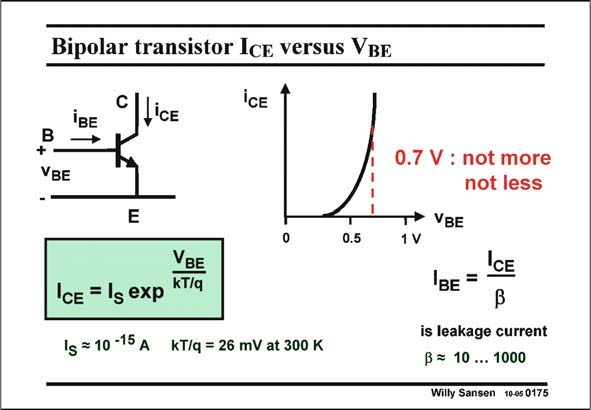

# SANSEN-0175 · Bipolar transistor Ice versus VBE

章节：01 MOS 晶体管与双极型晶体管的比较  
PDF 页：40；书本页：40；幻灯片编号：0175  
状态：unreviewed



## 对应教材讲解

### PDF 40 · 书本 40

When the Base-Emitter diode is forward biased, a large number of electrons flow from the n-side (Emitter) to the p-Base. Because the Base width W B is so small, most electrons are collected by the Collector. Actually they diffuse from Emitter to Collector. The resulting Collector current is nearly the same as the Emitter current. It is denoted by I and it is CE given as a function of the Base-Emitter voltage V by a similar exponential as for a forward-biased diode. Indeed the V BE BE is also scaled by kT/q in which k is the Boltzmann constant and q the charge of an electron

### PDF 41 · 书本 41

(1.6×10−19 C). Parameter T is the absolute temperature (in Kelvin or in degrees Celsius plus 273). At 20°C (or 86°F) kT/q is 25.86 mV. We will usually take 26 mV as the actual operating temperature may be higher. In power application this temperature may be a lot higher! The beauty of this scaling constant kT/q is that it is not changing from one technology to the next. It only contains fundamental physical parameters and the absolute temperature. This is one of the major advantages of the bipolar transistor. The second advantage of a bipolar transistor is that its characteristic is an exponential, which is mathematically the steepest curve around. Its derivative or the transconductance will be higher than for any other semiconductor device. Its main disadvantage however is that a Base current is flowing, which is a fraction 1/b of the collector current, and which is never well known.

## 公式／性能结论候选摘录

以下为规则截取的原文，尚未逐项判读。

（未由规则找到；不代表原页没有此类内容。）

## 曲线结论候选摘录

以下为规则截取的原文，尚未逐项判读。

- PDF 41: The second advantage of a bipolar transistor is that its characteristic is an exponential, which is mathematically the steepest curve around.

## 原文条件与近似候选摘录

以下为规则截取的原文，尚未逐项判读。

（未由规则找到；不代表原页没有此类内容。）

## 幻灯片 OCR（未校正）

```text
Bipolar transistor Ice versus VBE
iBE
C|lice
ICE
+-
VBE
E
0.5
VBE
IcE = 1g exp kT/q
Ig = 10 -15 A KT/q = 26 mV at 300 K
0.7 V : not more
not less
T* VBE
1V
ICE
BE =
is leakage current
B = 10 ... 1000
Willy Sansen 10-05 0175
```

数学上下标、分数及正负号以原图为准。电路图已保留；未核对的连接不输出成可仿真 netlist。
