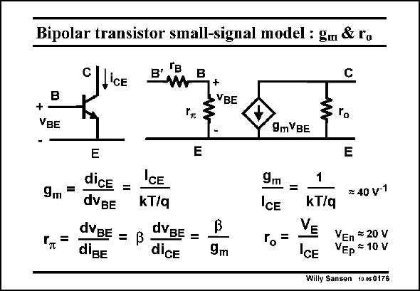

# SANSEN-0176 · Bipolar transistor small-signal model : gm & ru

章节：01 MOS 晶体管与双极型晶体管的比较  
PDF 页：41；书本页：41；幻灯片编号：0176  
状态：unreviewed



## 对应教材讲解

### PDF 41 · 书本 41

The small-signal model of a bipolar transistor is now easily derived. The transconductance g m is the derivative of the I −V curve. The g /I CE BE m CE ratio is simply one over kT/q. This is close to 40 per V, which is a lot larger than for a MOST. This is clearly one of the advantages of a bipolar transistor. The bipolar transistor also has a finite output resistance r . It can be modeled o by an Early Voltage V . E Note that this V actually depends on the Base width, which is however, not a degree of freedom E in a vertical npn, only in a lateral pnp as in MOST design. This value of V is given by the E technology description. It decreases for narrower Base widths. In order to accommodate the small-signal Base current, a resistor is added at the input. It is called r . It is the derivative of the I −V curve. As a result it contains both the transconductp BE BE ance g and current gain factor b. As this factor b is never accurately known, this resistor r is m p not well known either. It certainly depends on the current. For a current of 0.1 mA and a b of about 100, this resistor is about 26 kV. This is a rather low value and imprecise. It cannot be allowed to play an important role in high-precision circuitry. Finally, a Base resistor r has to be added in series with the input. It is an ohmic resistance B which is mainly the resistance of p-Base region between the Emitter side and the Base contact.

## 公式／性能结论候选摘录

以下为规则截取的原文，尚未逐项判读。

- PDF 41: E Note that this V actually depends on the Base width, which is however, not a degree of freedom E in a vertical npn, only in a lateral pnp as in MOST design.
- PDF 41: It decreases for narrower Base widths.
- PDF 41: As a result it contains both the transconductp BE BE ance g and current gain factor b.
- PDF 41: It certainly depends on the current.

## 曲线结论候选摘录

以下为规则截取的原文，尚未逐项判读。

- PDF 41: The transconductance g m is the derivative of the I −V curve.
- PDF 41: It is the derivative of the I −V curve.

## 原文条件与近似候选摘录

以下为规则截取的原文，尚未逐项判读。

（未由规则找到；不代表原页没有此类内容。）

## 幻灯片 OCR（未校正）

```text
Bipolar transistor small-signal model : gm & ru
B' TE
B
L'CE
+
•VBE
+
VBE
9mVBE
E
9. =
dice =
dVBe
kT/q
dVBE = ß
dVBE =
diBE
dice
9m
ICE
ro=
=
9m
C
3 г.
E
1
kT/q
≥ 40 v-1
VEn = 20 V
CE
VEp = 10 V
Willy Sansen 10.050176
```

数学上下标、分数及正负号以原图为准。电路图已保留；未核对的连接不输出成可仿真 netlist。
