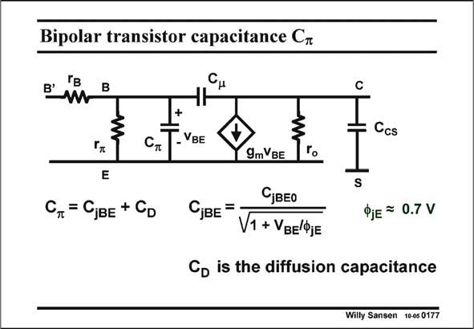

# SANSEN-0177 · Bipolar transistor capacitance C*

章节：01 MOS 晶体管与双极型晶体管的比较  
PDF 页：42；书本页：42；幻灯片编号：0177  
状态：unreviewed



## 对应教材讲解

### PDF 41 · 书本 41

As a bipolar transistor is built up with many junctions, it contains many junction capacitances. The most important ones are the Base-Emitter junction capacitance C and the CollectorjBE Substrate junction C . CS

### PDF 42 · 书本 42

The Collector-Base junction capacitance is called C . m However, the total input capacitance C , also inp cludes the diffusion capacitance C . Its origin is D explained next. Note however, that the Base-Emitter junction is forward biased. The value of the Base-Emitter junction capacitance C is thus jBE larger than its value at zero Volt, by a factor of 2 to 3.

## 公式／性能结论候选摘录

以下为规则截取的原文，尚未逐项判读。

- PDF 42: The value of the Base-Emitter junction capacitance C is thus jBE larger than its value at zero Volt, by a factor of 2 to 3.

## 曲线结论候选摘录

以下为规则截取的原文，尚未逐项判读。

（未由规则找到；不代表原页没有此类内容。）

## 原文条件与近似候选摘录

以下为规则截取的原文，尚未逐项判读。

（未由规则找到；不代表原页没有此类内容。）

## 幻灯片 OCR（未校正）

```text
Bipolar transistor capacitance C*
B'm
B
Ccs
- VBE
E
C, = CjBE + CD
9m BE
S
CjBEO
СjBE =
V1 + VBE/ФjE
ФjE = 0.7 V
Co is the diffusion capacitance
Willy Sansen 10-05 0177
```

数学上下标、分数及正负号以原图为准。电路图已保留；未核对的连接不输出成可仿真 netlist。
