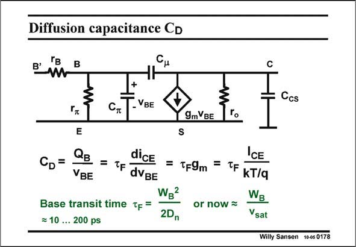

# SANSEN-0178 · Diffusion capacitance CD

章节：01 MOS 晶体管与双极型晶体管的比较  
PDF 页：42；书本页：42；幻灯片编号：0178  
状态：unreviewed



## 对应教材讲解

### PDF 42 · 书本 42

The diffusion capacitance C models the transition of D the electrons flowing through the Base region, as a result of the Base-Emitter voltage V . Indeed these BE electrons are minority carriers in the p-Base region. Their passing through the Base, represents a charge Q B in the base, which constantly disappears toward the Collector but which is also constantly replenished from the Emitter. These electrons take an average time t to flow through the Base. This time is called the Base transit time. This time constant F t allows this diffusion capacitance C to be described by t g , which obviously depends on F D F m the current I . CE The larger the current, the more C is dominant in C . On the other hand, for small currents, D p C consists mainly of the junction capacitance Q . p jBE This Base transit time t strongly depends on the Base width W , as shown in this slide. F B Parameter D is the diffusion constant of the electrons in the p-Base region. In high-speed devices however, all electrons move at maximum speed, which is the speed of velocity saturation v sat (107 cm/s), very much as in a high-speed MOST. The time needed by the electrons to flow through the Base is then easily calculated. It is in the order of ps. For example for a W of B 0.2 mm, t is a mere 2 ps!!! F

## 公式／性能结论候选摘录

以下为规则截取的原文，尚未逐项判读。

- PDF 42: The diffusion capacitance C models the transition of D the electrons flowing through the Base region, as a result of the Base-Emitter voltage V .
- PDF 42: This time constant F t allows this diffusion capacitance C to be described by t g , which obviously depends on F D F m the current I .
- PDF 42: On the other hand, for small currents, D p C consists mainly of the junction capacitance Q . p jBE This Base transit time t strongly depends on the Base width W , as shown in this slide.

## 曲线结论候选摘录

以下为规则截取的原文，尚未逐项判读。

（未由规则找到；不代表原页没有此类内容。）

## 原文条件与近似候选摘录

以下为规则截取的原文，尚未逐项判读。

- PDF 42: In high-speed devices however, all electrons move at maximum speed, which is the speed of velocity saturation v sat (107 cm/s), very much as in a high-speed MOST.

## 幻灯片 OCR（未校正）

```text
Diffusion capacitance CD
B'
Ccs
-VBE
9m BE
E
CD=
QB
dice
VBE
= TF dVBE
Base transit time Tp =
= 10 ... 200 ps
S
= TF9m
WB
2Dn
CE
=
TF KT/a
or now -
WB
Vsat
Willy Sansen 10-05 0178
```

数学上下标、分数及正负号以原图为准。电路图已保留；未核对的连接不输出成可仿真 netlist。
