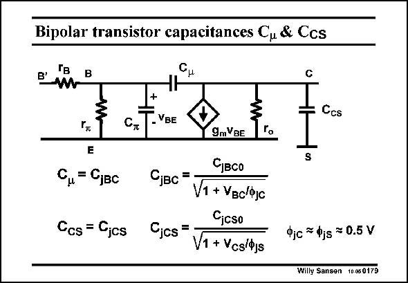

# SANSEN-0179 · Bipolar transistor capacitances Cu & Ccs

章节：01 MOS 晶体管与双极型晶体管的比较  
PDF 页：43；书本页：43；幻灯片编号：0179  
状态：unreviewed



## 对应教材讲解

### PDF 43 · 书本 43

The other capacitances are all junction capacitances indeed, all reverse biased. The Collector-Base junction capacitance is called C . It is usually quite small. m The Collector-Substrate junction C on the other CS hand, is usually quite large as the whole transistor structure is embedded in its collector tub. Moreover, it is connected at the Collector, which usually functions at the output of the transistor. It plays an important role once high-frequency performance is envisaged.

## 公式／性能结论候选摘录

以下为规则截取的原文，尚未逐项判读。

（未由规则找到；不代表原页没有此类内容。）

## 曲线结论候选摘录

以下为规则截取的原文，尚未逐项判读。

（未由规则找到；不代表原页没有此类内容。）

## 原文条件与近似候选摘录

以下为规则截取的原文，尚未逐项判读。

（未由规则找到；不代表原页没有此类内容。）

## 幻灯片 OCR（未校正）

```text
Bipolar transistor capacitances Cu & Ccs
Гв
B'
Ccs
-VBE
Чть
E
Cu= Cjвс
Cos = Cjcs
9mVBE
Сувсо
Cjвс
V1 + Увс'Фс
Cjcso
°jcs =
V1 + Vcs/ojs
To
S
Фjc 7 djs = 0.5 V
Willy Sansen 10.050179
```

数学上下标、分数及正负号以原图为准。电路图已保留；未核对的连接不输出成可仿真 netlist。
