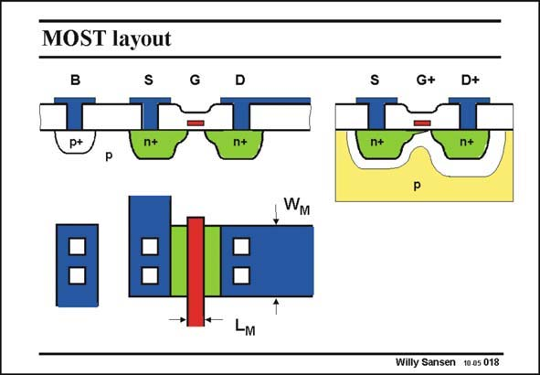

# SANSEN-018 · MOST layout

章节：01 MOS 晶体管与双极型晶体管的比较  
PDF 页：5；书本页：5；幻灯片编号：018  
状态：unreviewed



## 对应教材讲解

### PDF 4 · 书本 4

Let us have a closer look now at a MOST device. What are the main parameters involved, and what are the simplest possible model equations that still describe the transistor models in an adequate way for hand analysis.

### PDF 5 · 书本 5

The cross-section of a MOS transistor is shown with its layout. On the left, the MOST is shown without biasing. On the right, voltages are applied to Gate and Drain. The main dimensions of a MOST are the Length and Width. Both are drawn dimensions on the mask. In practice they are usually a bit smaller. This is a result of underdiffusion and some more technological steps. In this layout the W/L on the mask is about 5. Application of a positive voltage at the Gate V causes a negatively charged inversion layer, GS which connects the Source and Drain n+ islands. It is a conducting channel between Source and Drain and thus acts as a resistor between Source and Drain. Application of a positive voltage at the Drain V , with respect to the Source, allows some DS current to flow from Drain to Source (or electrons from Source to Drain). This current is I . As DS a result, the channel becomes non-homogeneous. It conducts better on the Source side than on the Drain side. The channel may even disappear on the Drain side. Nevertheless, the electrons always manage to make it to the other side, because they have acquired sufficient speed along the channel.

## 公式／性能结论候选摘录

以下为规则截取的原文，尚未逐项判读。

- PDF 5: It is a conducting channel between Source and Drain and thus acts as a resistor between Source and Drain.

## 曲线结论候选摘录

以下为规则截取的原文，尚未逐项判读。

（未由规则找到；不代表原页没有此类内容。）

## 原文条件与近似候选摘录

以下为规则截取的原文，尚未逐项判读。

（未由规则找到；不代表原页没有此类内容。）

## 幻灯片 OCR（未校正）

```text
MOST layout
B
n+
G+
D+
WM
Willy Sansen 10.05 018
```

数学上下标、分数及正负号以原图为准。电路图已保留；未核对的连接不输出成可仿真 netlist。
