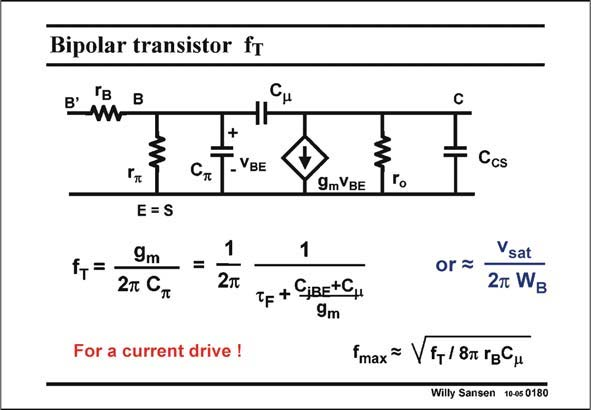

# SANSEN-0180 · Bipolar transistor fT

章节：01 MOS 晶体管与双极型晶体管的比较  
PDF 页：43；书本页：43；幻灯片编号：0180  
状态：unreviewed



## 对应教材讲解

### PDF 43 · 书本 43

In the same way as for a MOST, parameter f repre- T sents the high-frequency capability of a bipolar transistor. It is the frequency where the current gain is unity, in an output short. It is also the frequency of the time constant consisting of 1/g and input capacitance m C . p Substitution of these two parameters yields the expression given in this slide. It clearly shows that f T heavily depends on the current. The maximum value of f is reached for high currents. This is hardly a surprising result T indeed! This maximum value is simply linked to the Base transit time t . For example, for a t of 2 F F ps, f becomes 160 GHz, which is quite high indeed! T At lower currents, the two junction capacitances take over. The values of f are then smaller. T They are plotted next. Note that f includes again the parameters r and C , as for a MOST. max B m

## 公式／性能结论候选摘录

以下为规则截取的原文，尚未逐项判读。

- PDF 43: It is the frequency where the current gain is unity, in an output short.
- PDF 43: It clearly shows that f T heavily depends on the current.

## 曲线结论候选摘录

以下为规则截取的原文，尚未逐项判读。

- PDF 43: T They are plotted next.

## 原文条件与近似候选摘录

以下为规则截取的原文，尚未逐项判读。

（未由规则找到；不代表原页没有此类内容。）

## 幻灯片 OCR（未校正）

```text
Bipolar transistor fT
B'
B
+
-VBE
Ccs
9mVBE
Гo
E=S
f,=-
9m
2т Cn
1
=
For a current drive !
1
Tf + CIBE+C,
9m
or -
Vsat
2т WB
fmax ~ V f+/8r rgCu
Willy Sansen 10-05 0180
```

数学上下标、分数及正负号以原图为准。电路图已保留；未核对的连接不输出成可仿真 netlist。
