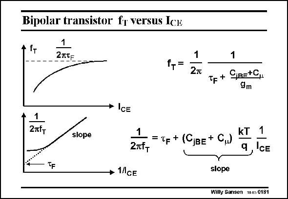

# SANSEN-0181 · Bipolar transistor fr versus Ick

章节：01 MOS 晶体管与双极型晶体管的比较  
PDF 页：44；书本页：44；幻灯片编号：0181  
状态：unreviewed



## 对应教材讲解

### PDF 44 · 书本 44

The values of f are plotted T versus current I twice. CE In the top diagram, both scales are linear. It is clear that the maximum value of f is reached for high cur- T rents. Its value is then determined by the Base transit time t . F It is more instructive however to plot the inverse of f versus the inverse of the T current. The extrapolated value at zero 1/I is then CE again t , but the slope of the F curve, which is now linear, is determined by the junction capacitances C and C . jBE m Remember that capacitance C is taken in forward bias. This is one of the few ways to jBE measure this capacitance in forward bias!

## 公式／性能结论候选摘录

以下为规则截取的原文，尚未逐项判读。

（未由规则找到；不代表原页没有此类内容。）

## 曲线结论候选摘录

以下为规则截取的原文，尚未逐项判读。

- PDF 44: The values of f are plotted T versus current I twice.
- PDF 44: F It is more instructive however to plot the inverse of f versus the inverse of the T current.
- PDF 44: The extrapolated value at zero 1/I is then CE again t , but the slope of the F curve, which is now linear, is determined by the junction capacitances C and C . jBE m Remember that capacitance C is taken in forward bias.

## 原文条件与近似候选摘录

以下为规则截取的原文，尚未逐项判读。

（未由规则找到；不代表原页没有此类内容。）

## 幻灯片 OCR（未校正）

```text
Bipolar transistor fr versus Ick
1
Iт
f,=
1
2т
1
Tp+ C,a=+0,
9m
*ICE
2xfT
slope
TF
1
kT
=Tр + (CjвE+ C)
27t-
1
9
1CE
slope
Willy Sansen W-s 0181
```

数学上下标、分数及正负号以原图为准。电路图已保留；未核对的连接不输出成可仿真 netlist。
