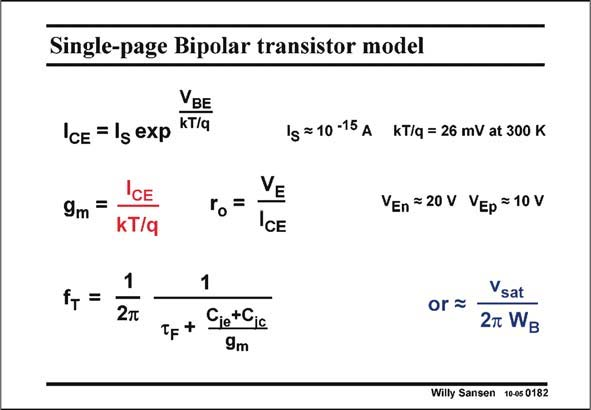

# SANSEN-0182 · Single-page Bipolar transistor model

章节：01 MOS 晶体管与双极型晶体管的比较  
PDF 页：44；书本页：44；幻灯片编号：0182  
状态：unreviewed



## 对应教材讲解

### PDF 44 · 书本 44

In the same way as for a MOST, all important expressions which are required to be known by heart, are collected under the name ‘‘Single-page bipolar model’’. They will be used throughout this text. It will now be quite easy to memorize them.

## 公式／性能结论候选摘录

以下为规则截取的原文，尚未逐项判读。

（未由规则找到；不代表原页没有此类内容。）

## 曲线结论候选摘录

以下为规则截取的原文，尚未逐项判读。

（未由规则找到；不代表原页没有此类内容。）

## 原文条件与近似候选摘录

以下为规则截取的原文，尚未逐项判读。

（未由规则找到；不代表原页没有此类内容。）

## 幻灯片 OCR（未校正）

```text
Single-page Bipolar transistor model
VBE
IcE = 1g exp kT/q
1s =10-15 A KT/q= 26 mV at 300 K
CE
9m =
kT/q
VE
ro=
IcE
f, =
1
2T
1
Tp + Cie+Cic
9m
VEn =20 V VEp =10 V
Vsat
or=-
2T WB
Willy Sansen 10-05 0182
```

数学上下标、分数及正负号以原图为准。电路图已保留；未核对的连接不输出成可仿真 netlist。
