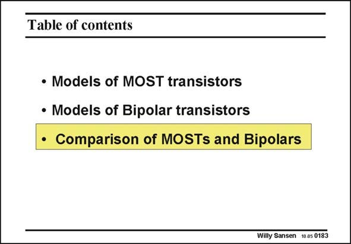

# SANSEN-0183 · Table of contents

章节：01 MOS 晶体管与双极型晶体管的比较  
PDF 页：45；书本页：45；幻灯片编号：0183  
状态：unreviewed



## 对应教材讲解

### PDF 45 · 书本 45

Now that the models of both the MOST and the bipolar transistor have been explained in simple terms, the question arises how do they compare for circuit performance. Indeed, both of them are available in BiCMOS processes. For each function, a choice can be made between both types.

## 公式／性能结论候选摘录

以下为规则截取的原文，尚未逐项判读。

（未由规则找到；不代表原页没有此类内容。）

## 曲线结论候选摘录

以下为规则截取的原文，尚未逐项判读。

（未由规则找到；不代表原页没有此类内容。）

## 原文条件与近似候选摘录

以下为规则截取的原文，尚未逐项判读。

（未由规则找到；不代表原页没有此类内容。）

## 幻灯片 OCR（未校正）

```text
Table of contents
• Models of MOST transistors
• Models of Bipolar transistors
• Comparison of MOSTs and Bipolars
Willy Sansen 10.05 0183
```

数学上下标、分数及正负号以原图为准。电路图已保留；未核对的连接不输出成可仿真 netlist。
