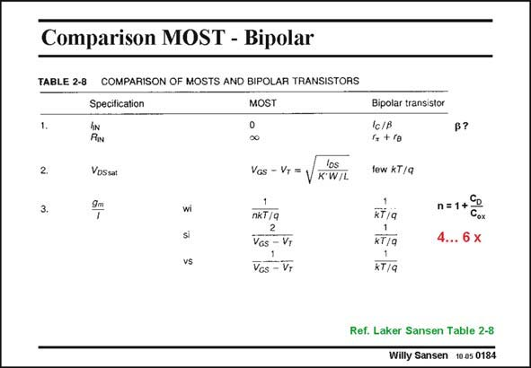

# SANSEN-0184 · Comparison MOST - Bipolar

章节：01 MOS 晶体管与双极型晶体管的比较  
PDF 页：45；书本页：45；幻灯片编号：0184  
状态：unreviewed



## 对应教材讲解

### PDF 45 · 书本 45

In order to organize the comparison, a Table is used listing most important parameters, under ‘‘Specification’’. The relevant arguments are then collected in two columns, one for MOSTs and one for bipolar transistors. It is clear that the zero input current is a major advantage for a MOST. As a result, its input impedance is infinity. It is now possible to store a charge on a capacitance and read it with a nMOST. This is used in switched-capacitor filters (see Chapter 17) but also in Sample-andhold circuits in front of ADC’s. In future nanometer technologies however, Gate current may flow in a similar way as for bipolar transistors. This is an enormous disadvantage for many circuits! The second consideration is on the minimum V . It is the minimum output voltage for DSsat which the MOST operates in saturation, exhibiting a large output resistance r , and thus o large gain.

## 公式／性能结论候选摘录

以下为规则截取的原文，尚未逐项判读。

- PDF 45: As a result, its input impedance is infinity.
- PDF 45: It is the minimum output voltage for DSsat which the MOST operates in saturation, exhibiting a large output resistance r , and thus o large gain.

## 曲线结论候选摘录

以下为规则截取的原文，尚未逐项判读。

（未由规则找到；不代表原页没有此类内容。）

## 原文条件与近似候选摘录

以下为规则截取的原文，尚未逐项判读。

- PDF 45: It is the minimum output voltage for DSsat which the MOST operates in saturation, exhibiting a large output resistance r , and thus o large gain.

## 幻灯片 OCR（未校正）

```text
Comparison MOST - Bipolar
TABLE 2-8 COMPARISON OF MOSTS AND BIPOLAR TRANSISTORS
Specification
MOST
hN
RIN
VDSsat
Bipolar transistor
Ic/P
1, + ra
lew kT/Q
p?
2.
3.
wi
si
vs
Vos - Vr = VK-W/L
nkT/q
2
Vos - VT
Vos - V;
n=1+C
4... 6 x
KT/Q
1
KT/Q
Ref. Laker Sansen Table 2-8
Willy Sansen 10.05 0184
```

数学上下标、分数及正负号以原图为准。电路图已保留；未核对的连接不输出成可仿真 netlist。
