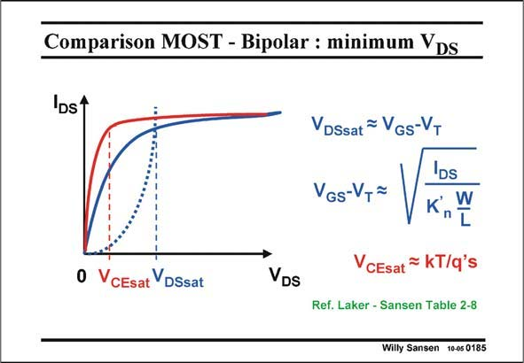

# SANSEN-0185 · Comparison MOST - Bipolar : minimum VDs

章节：01 MOS 晶体管与双极型晶体管的比较  
PDF 页：46；书本页：46；幻灯片编号：0185  
状态：unreviewed



## 对应教材讲解

### PDF 45 · 书本 45

The minimum V , for which the MOST operates in saturation, is little less than V −V , DSsat GS T which also sets the current depending on the transistor dimensions W and L.

### PDF 46 · 书本 46

For high-gain stages the V −V is chosen to be GS T small, such as 0.15–0.2 V. The voltage loss V is DSsat also small. For high-speed stages on the other hand, this V −V may be as high as GS T 0.5 V. The Drain-Source voltage can never be less than 0.5 V without losing gain. This creates a severe limitation in output swing. Bipolar transistors always exhibit a minimum output voltage of a few times kT/q. This is more of the order of magnitude of 0.1 V, whatever purpose the transistor is used for, high gain of high speed. This is clearly an advantage for the bipolar transistor. It is still the favorite device for very low supply voltages.

## 公式／性能结论候选摘录

以下为规则截取的原文，尚未逐项判读。

- PDF 45: The minimum V , for which the MOST operates in saturation, is little less than V −V , DSsat GS T which also sets the current depending on the transistor dimensions W and L.
- PDF 46: For high-gain stages the V −V is chosen to be GS T small, such as 0.15–0.2 V.
- PDF 46: The Drain-Source voltage can never be less than 0.5 V without losing gain.
- PDF 46: This creates a severe limitation in output swing.
- PDF 46: This is more of the order of magnitude of 0.1 V, whatever purpose the transistor is used for, high gain of high speed.

## 曲线结论候选摘录

以下为规则截取的原文，尚未逐项判读。

（未由规则找到；不代表原页没有此类内容。）

## 原文条件与近似候选摘录

以下为规则截取的原文，尚未逐项判读。

- PDF 45: The minimum V , for which the MOST operates in saturation, is little less than V −V , DSsat GS T which also sets the current depending on the transistor dimensions W and L.

## 幻灯片 OCR（未校正）

```text
Comparison MOST - Bipolar : minimum VDs
'DS'
0
V CEsat VDSsat
VDs
VDSsat = VGS-T
VGs-V,~
Vi
IDs
CEsat
KT/q's
Ref. Laker - Sansen Table 2-8
Willy Sansen 10-05 0185
```

数学上下标、分数及正负号以原图为准。电路图已保留；未核对的连接不输出成可仿真 netlist。
