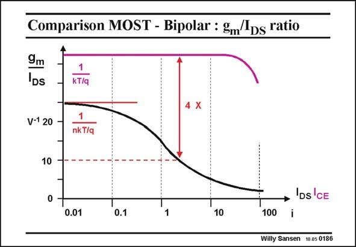

# SANSEN-0186 · Comparison MOST - Bipolar : gm/lDs ratio

章节：01 MOS 晶体管与双极型晶体管的比较  
PDF 页：46；书本页：46；幻灯片编号：0186  
状态：unreviewed



## 对应教材讲解

### PDF 46 · 书本 46

The g /I ratio is also m DS better with a bipolar transistor. Indeed, this ratio continues to decrease for a MOST, at increasing current (or inversion factor i). For a bipolar transistor this ratio is larger to start with, even at very low currents, but also remains large for intermediate currents. For a V −V of 0.15–0.2 V, the GS T g /I ratio is around a m DS factor of 4 better for a bipolar transistor than for a MOST. For the same transconductance, a bipolar transistor only requires 25% of the current of a MOST. This is a considerable advantage for portable applications, where battery power is expensive.

## 公式／性能结论候选摘录

以下为规则截取的原文，尚未逐项判读。

- PDF 46: Indeed, this ratio continues to decrease for a MOST, at increasing current (or inversion factor i).

## 曲线结论候选摘录

以下为规则截取的原文，尚未逐项判读。

（未由规则找到；不代表原页没有此类内容。）

## 原文条件与近似候选摘录

以下为规则截取的原文，尚未逐项判读。

（未由规则找到；不代表原页没有此类内容。）

## 幻灯片 OCR（未校正）

```text
Comparison MOST - Bipolar : gm/lDs ratio
9m
DS
1
kT/q
V-1 20
1
nk T/q
10
• 'DS'CE
0.01
0.1
10
100
Willy Sansen 10.05 0186
```

数学上下标、分数及正负号以原图为准。电路图已保留；未核对的连接不输出成可仿真 netlist。
