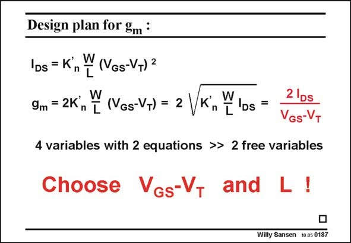

# SANSEN-0187 · Design plan for 9m :

章节：01 MOS 晶体管与双极型晶体管的比较  
PDF 页：47；书本页：47；幻灯片编号：0187  
状态：unreviewed



## 对应教材讲解

### PDF 46 · 书本 46

The difference in design plan is a fourth consideration. A MOST has two expressions for the current I and the transconductance g . However, they DS m contain five variables (or design parameters). They are I , g and V −V , W and L. DS m GS T Most often the transconductance g is imposed as a result of circuit specifications. This leaves m

### PDF 47 · 书本 47

us with 4 variables. The ones with the smallest ranges are better chosen up front. They are V −V and L. GS T The first choice to be made is the V −V as it GS T sets the operating point of the transistor. It fixes the g /I ratio and the inverm DS sion and velocity coefficients, all at the same time. It is clearly the first choice to be made. In general, for high-gain stages the V − GS V is chosen between 0.15 T and 0.2 V, for high-speed stages the V −V is GS T chosen around 0.5 V. Once g and V −V are known, the I is known as well, from which W/L is readily m GS T DS calculated. From the choice of L, W is calculated. In general, for high-gain stages the L is chosen 4–8 times the minimum L, for high-speed stages the L is chosen minimal.

## 公式／性能结论候选摘录

以下为规则截取的原文，尚未逐项判读。

- PDF 46: DS m GS T Most often the transconductance g is imposed as a result of circuit specifications.
- PDF 47: In general, for high-gain stages the V − GS V is chosen between 0.15 T and 0.2 V, for high-speed stages the V −V is GS T chosen around 0.5 V.
- PDF 47: In general, for high-gain stages the L is chosen 4–8 times the minimum L, for high-speed stages the L is chosen minimal.

## 曲线结论候选摘录

以下为规则截取的原文，尚未逐项判读。

（未由规则找到；不代表原页没有此类内容。）

## 原文条件与近似候选摘录

以下为规则截取的原文，尚未逐项判读。

（未由规则找到；不代表原页没有此类内容。）

## 幻灯片 OCR（未校正）

```text
Design plan for 9m :
lDs = K',
W (VGs-VT) 2
9m = 2K n [ (VGs-VT) = 2
Ds =
2 Ds
VGs-VT
4 variables with 2 equations >> 2 free variables
Choose VGs-V, and L !
Willy Sansen 10.05 0187
```

数学上下标、分数及正负号以原图为准。电路图已保留；未核对的连接不输出成可仿真 netlist。
