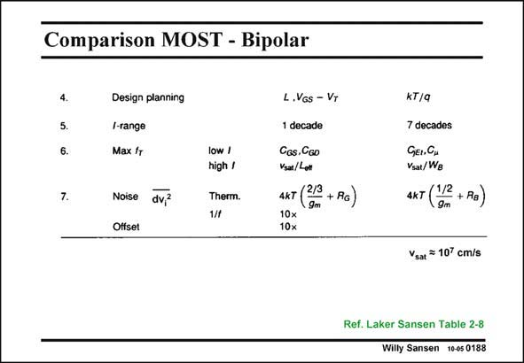

# SANSEN-0188 · Comparison MOST - Bipolar

章节：01 MOS 晶体管与双极型晶体管的比较  
PDF 页：47；书本页：47；幻灯片编号：0188  
状态：unreviewed



## 对应教材讲解

### PDF 47 · 书本 47

After the difference in design plan (number 4), we have a look at the accuracy of the models (number 5). A MOST needs three models to cover the whole current range, and many transistor parameters, which is expanding continuously. A bipolar transistor only needs one single model, which is quite precise. Moreover, it has had the same model for years. This single model is valid over a large number (more than 7), of decades in current, contrary to a MOST, where one model is valid over only 1 or 2 decades in current. Speed is another point of comparison. At high currents all electrons move at the speed of v . sat As a result the highest speed device is the one with the smaller dimension the channel length L or the Base width W . The channel length is being decreased continuously, which is not the case B for the Base width. Nanometer CMOS technologies are capable of a very-high-frequency performance indeed!

### PDF 48 · 书本 48

Noise is next. The expressions of the thermal noise are nearly the same for both transistor types. The factor 2/3 is close to 1/2 indeed. However, for the same current the g of a bipolar m transistor is larger and hence its thermal noise is lower. This is very different for 1/f noise. A bipolar transistor is a bulk device. Its 1/f equivalent input noise voltage is smaller by an order of magnitude and so is its offset voltage.

## 公式／性能结论候选摘录

以下为规则截取的原文，尚未逐项判读。

- PDF 47: At high currents all electrons move at the speed of v . sat As a result the highest speed device is the one with the smaller dimension the channel length L or the Base width W .
- PDF 47: The channel length is being decreased continuously, which is not the case B for the Base width.

## 曲线结论候选摘录

以下为规则截取的原文，尚未逐项判读。

（未由规则找到；不代表原页没有此类内容。）

## 原文条件与近似候选摘录

以下为规则截取的原文，尚未逐项判读。

（未由规则找到；不代表原页没有此类内容。）

## 幻灯片 OCR（未校正）

```text
Comparison MOST - Bipolar
4.
5.
7.
Design planning
I-range
Max fr
Noise dv?
Offset
low /
high /
Therm.
L.Vos - VT
1 decade
Cos. GG0
Vea/Loe
4кт (23 + Ra)
10x
KT/q
7 decades
GEI. CH
Ysat/Wg
AкT (12+ Ra)
Vsar = 10% cm/s
Ref. Laker Sansen Table 2-8
Willy Sansen 10-0s 0188
```

数学上下标、分数及正负号以原图为准。电路图已保留；未核对的连接不输出成可仿真 netlist。
