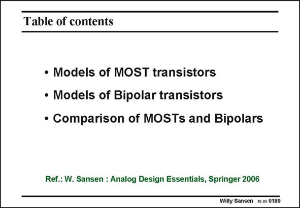

# SANSEN-0189 · Table of contents

章节：01 MOS 晶体管与双极型晶体管的比较  
PDF 页：48；书本页：48；幻灯片编号：0189  
状态：unreviewed



## 对应教材讲解

### PDF 48 · 书本 48

This concludes the comparison between MOSTs and bipolar transistors. It is clear that a bipolar transistor is better for highprecision circuitry, but a MOST is more compatible with CMOS logic. A BiCMOS process seems to be the ideal compromise, but is more expensive unfortunately. Now that models for hand calculations have been derived, they will be used in elementary circuits.

## 公式／性能结论候选摘录

以下为规则截取的原文，尚未逐项判读。

（未由规则找到；不代表原页没有此类内容。）

## 曲线结论候选摘录

以下为规则截取的原文，尚未逐项判读。

（未由规则找到；不代表原页没有此类内容。）

## 原文条件与近似候选摘录

以下为规则截取的原文，尚未逐项判读。

（未由规则找到；不代表原页没有此类内容。）

## 幻灯片 OCR（未校正）

```text
Table of contents
• Models of MOST transistors
• Models of Bipolar transistors
• Comparison of MOSTs and Bipolars
Ref.: W. Sansen : Analog Design Essentials, Springer 2006
Willy Sansen 1005 0189
```

数学上下标、分数及正负号以原图为准。电路图已保留；未核对的连接不输出成可仿真 netlist。
