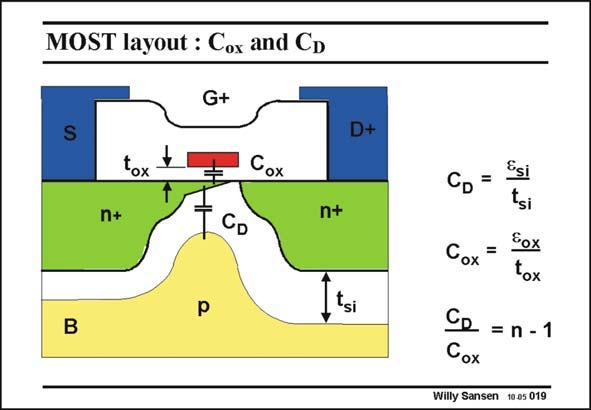

# SANSEN-019 · MOST layout : Cox and CD

章节：01 MOS 晶体管与双极型晶体管的比较  
PDF 页：5；书本页：5；幻灯片编号：019  
状态：unreviewed



## 对应教材讲解

### PDF 5 · 书本 5

Zooming in on the channel region, disappears once V DS is too high. The channel region, together with the two n+ islands of Source and Drain, are enveloped by an isolation layer. Indeed, in a pn junction the p and n regions are always separated by an isolation region, which is called depletion region. The silicon is depleted of electrons or holes; it is nonconducting, it is an isolator, very much as oxide an isolator is. The oxide has a thickness t , whereas the depletion layer has a thickness of t . Both give ox si rise to capacitances C and C , respectively. Both have dimensions F/cm−2. Normally C is ox D D about one third of C as we will calculate in detail on the next slide. Their ratio is n-1 [Tsividis]. ox

### PDF 6 · 书本 6

It is mportant, however, to note that the channel inversion layer is coupled to the Gate by means of C , but as much coupled to the Bulk by C . Changing the Gate voltage will thus ox D change the conductivity of the channel and hence the current I . In a similar way, changing DS the Bulk voltage will thus also change the conductivity of the channel and will thus change the current I as well. The top gate gives the MOST operation, whereas the bulk gives JFET DS operation. Indeed, a Junction FET is by definition a FET in which the current is controlled by a junction capacitance. All MOST devices are thus parallel combinations of MOSTs and JFETs. We normally use only the MOST whereas the JFET is called the body effect, and is treated as a parasitic effect.

## 公式／性能结论候选摘录

以下为规则截取的原文，尚未逐项判读。

- PDF 6: Changing the Gate voltage will thus ox D change the conductivity of the channel and hence the current I .
- PDF 6: In a similar way, changing DS the Bulk voltage will thus also change the conductivity of the channel and will thus change the current I as well.
- PDF 6: All MOST devices are thus parallel combinations of MOSTs and JFETs.

## 曲线结论候选摘录

以下为规则截取的原文，尚未逐项判读。

（未由规则找到；不代表原页没有此类内容。）

## 原文条件与近似候选摘录

以下为规则截取的原文，尚未逐项判读。

（未由规则找到；不代表原页没有此类内容。）

## 幻灯片 OCR（未校正）

```text
MOST layout : Cox and CD
G+
S
D+
tox
Cox
n+
CD
n+
tsi
B
Esi
CD =
tsi
Eox
Cox
=
tox
CR = n - 1
Cox
Willy Sansen 10.05 019
```

数学上下标、分数及正负号以原图为准。电路图已保留；未核对的连接不输出成可仿真 netlist。
