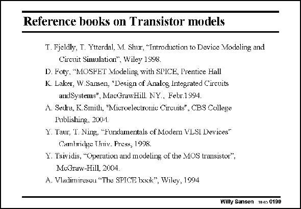

# SANSEN-0190 · Reference books on Transistor models

章节：01 MOS 晶体管与双极型晶体管的比较  
PDF 页：48；书本页：48；幻灯片编号：0190  
状态：unreviewed



## 对应教材讲解

### PDF 48 · 书本 48

Several books are available which provide many more details on MOST models. The best known one is undoubtedly the one of Y. Tsividis. Some other books concentrate on the models as they are implemented in SPICE.

## 公式／性能结论候选摘录

以下为规则截取的原文，尚未逐项判读。

（未由规则找到；不代表原页没有此类内容。）

## 曲线结论候选摘录

以下为规则截取的原文，尚未逐项判读。

（未由规则找到；不代表原页没有此类内容。）

## 原文条件与近似候选摘录

以下为规则截取的原文，尚未逐项判读。

（未由规则找到；不代表原页没有此类内容。）

## 幻灯片 OCR（未校正）

```text
Reference books on Transistor models
T. Fjeldly, T. Ytterdal, Mi. Shur, *Introdhiction to Device Vodeling and
Crcuit Simulation*, Wiley 1998
D. Foty, "MOSFET Modeling with SPICE, Prentice Hall
K. Laker, W.Sansen, "Dasign of Analog Integrated Circuits
andSystems", MacGrawHill. NY., Febr 1994.
A. Sedra, K.Smith, "Microelectronic Circuits", CBS College
Publishing, 2004.
Y. Taur, T. Ning, "F'undamentals of Modern VLSI Devices"
Cambridge TIniv. Press, 1998.
Y. Tsividis, "Operation and modeling of the MOS transistor".
MuGraw-Hill, 2004.
A. Vladirmirexcu "The SPTCE look", Wiley, 1994
Willy Sansen M4s 019D
```

数学上下标、分数及正负号以原图为准。电路图已保留；未核对的连接不输出成可仿真 netlist。
