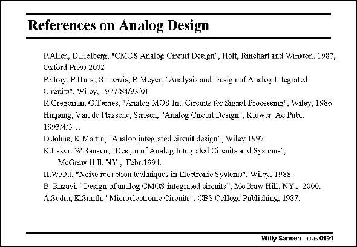

# SANSEN-0191 · References on Analog Design

章节：01 MOS 晶体管与双极型晶体管的比较  
PDF 页：49；书本页：49；幻灯片编号：0191  
状态：unreviewed



## 对应教材讲解

### PDF 49 · 书本 49

Other books are more general. They give an introduction on models but are mainly focused on analog circuit design. One of the main ‘‘classics’’ is Gray and Meyer, now Gray, Hurst, Lewis and Meyer. The ones under Huijsing, Van de Plassche and Sansen are actually Proceedings of the annual European workshop ‘‘Advances in Analog Circuit Design’’, which was organized the first time in 1993. All the other ones are textbooks.

## 公式／性能结论候选摘录

以下为规则截取的原文，尚未逐项判读。

（未由规则找到；不代表原页没有此类内容。）

## 曲线结论候选摘录

以下为规则截取的原文，尚未逐项判读。

（未由规则找到；不代表原页没有此类内容。）

## 原文条件与近似候选摘录

以下为规则截取的原文，尚未逐项判读。

（未由规则找到；不代表原页没有此类内容。）

## 幻灯片 OCR（未校正）

```text
References on Analog Design
P.Allen, D.Holberg, "CMOS Analog Cireuit Design", Holt, Rinchart and Winston. 1987,
Oxlord Pross 2002
P.Uray, P.Ilurst, S. Lewis, R.Mcyer, "Analysis and Doxign of Analoy Inlugrated
Cirenits", Wiley, 1997/81/93/01
R.Gregoriun, G.T'eres, "Analog MOS Int. Circuits for Signal Processing", Wiley, 1986.
Huijsing, Vaut de Plaesche, Sausen, "Analog Cireuit Design", Kluwer Ae.Publ.
1993:1:5....
D.Joluis. K.Martin, "Analog integrated circuit design", Wiley 1997.
K.Laker, W.Sanscn, "Dosign of Analog Intograted Circuits and Systoms",
MeGmw Hill. VY., Febr.1991.
LL. W.Ott, "Noise reduction techniques in Lilectronic Systems", Wiley, 1988.
B. Razavi, "Design of analog CMOS integrated circuits", MeGraw Hill. NY., 2000.
A.Sedra, K.Smith, "Mieroclectronie Cireuits", CBS College Publishing, 1987.
Willy Sansen 1Hs 0191
```

数学上下标、分数及正负号以原图为准。电路图已保留；未核对的连接不输出成可仿真 netlist。
