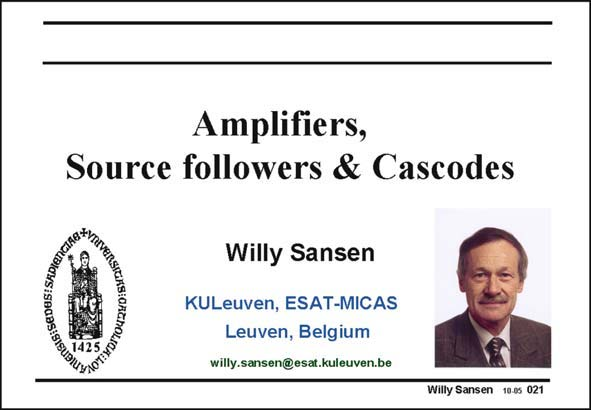

# SANSEN-021 · Slide 021

章节：02 放大器、源极跟随器与共源共栅级  
PDF 页：50；书本页：51；幻灯片编号：021  
状态：unreviewed



## 第二章公式推导

章节首页，无独立公式；阅读共同模型与符号。

[完整 Markdown 解释](../../derivations/ch02/00-conventions.md) · [排版公式网页](../../derivations/ch02/00-conventions.html)

状态：context_reviewed_no_independent_derivation；SFG：not_applicable。本页为章节脉络，无独立小信号模型需建图。

模型、近似与来源差异以新推导页为准；下方保留第一步的原始抽取。

## 对应教材讲解

### PDF 50 · 书本 51

All analog circuits are built up by means of a limited number of elementary building blocks. Thorough knowledge of these blocks is therefore essential to obtain insight into more complicated circuit schematics. This is why they are considered separately and analyzed in great detail. Several overview slides are added so as not to lose the context out of sight.

## 公式／性能结论候选摘录

以下为规则截取的原文，尚未逐项判读。

- PDF 50: All analog circuits are built up by means of a limited number of elementary building blocks.
- PDF 50: Thorough knowledge of these blocks is therefore essential to obtain insight into more complicated circuit schematics.

## 曲线结论候选摘录

以下为规则截取的原文，尚未逐项判读。

（未由规则找到；不代表原页没有此类内容。）

## 原文条件与近似候选摘录

以下为规则截取的原文，尚未逐项判读。

（未由规则找到；不代表原页没有此类内容。）

## 幻灯片 OCR（未校正）

```text
Amplifiers,
Source followers & Cascodes
Willy Sansen
KULeuven, ESAT-MICAS
Leuven, Belgium
willy.sansen@esat.kuleuven.be
Willy Sansen 10.0s 021
```

数学上下标、分数及正负号以原图为准。电路图已保留；未核对的连接不输出成可仿真 netlist。
