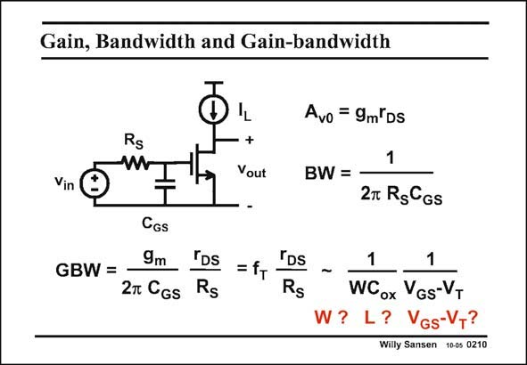
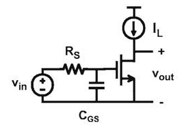

# SANSEN-0210 · 输入电容对增益与带宽的影响

章节：02 放大器、源极跟随器与共源共栅级  
PDF 页：54；书本页：55；幻灯片编号：0210  
状态：representative_case_visually_reviewed



## Spectre 仿真

本推导组的代表模型已完成 Spectre 验证；覆盖范围以所列网表为准，未逐一搭建所有幻灯片电路。

[本组波形与仿真报告](../../simulations/ch02/index.html#02-single-pole)

## 第二章公式推导

推导负载电容主极点、交越频率、GBW 与 029 的尺寸例题。

[完整 Markdown 解释](../../derivations/ch02/02-single-pole.md) · [排版公式网页](../../derivations/ch02/02-single-pole.html)

状态：derived_in_stated_model；SFG：not_needed。此组以微分、KCL 或矩阵即可说明机制，没有必要另画 SFG。

模型、近似与来源差异以新推导页为准；下方保留第一步的原始抽取。

## 对应教材讲解

### PDF 54 · 书本 55

If no load capacitance is present, but a large input capacitance C , then the GS bandwidth is determined at the input. This is also true for many sensor and biomedical preamplifiers where the source resistance can be quite high (>1 MV). In this case, the BW is simply given by the RC product at the input. The GBW on the other hand, is not as simple as before. Many transistor parameters now play a role. Some of them can be bundled in the high-frequency parameter f . T For high-frequency performance, it is not sufficient however to make f large. Rather the T product f r must be optimized, which is a technological challenge indeed! T DS The channel length does not seem to play a role; both W and V −V must be made small!!! GS T All surprising results indeed!

## 已核对的抽取

只保留输入电容时，信号源电阻 R_S 与 C_GS 决定带宽。原文指出优化 f_T 本身不足，还要考虑 f_T r_DS。

- `A_{v0}=g_m r_{DS}` — 低频增益大小。
- `BW=\frac{1}{2\pi R_S C_{GS}}` — 输入 RC 带宽。
- `GBW=\frac{g_m}{2\pi C_{GS}}\frac{r_{DS}}{R_S}=f_T\frac{r_{DS}}{R_S}\sim\frac{1}{W C_{ox}}\frac{1}{V_{GS}-V_T}` — 最后的 ~ 为幻灯片所列的尺度关系，不应当作含全部常数的严格等式。



### 曲线结论


### 条件与近似注记

- 原文明示：没有负载电容，只考虑较大的输入电容。
- 图面判读：本页 f_T 表达式创建在所保留的 C_GS 简化模型上；不要自动套到含 C_GD 等寄生的完整模型。

### 连接关系

- 共源级的源极接地，漏极为输出并接偏置电流源。
- v_in 经 R_S 接栅极；C_GS 位于栅极与地之间。

## 公式／性能结论候选摘录

以下为规则截取的原文，尚未逐项判读。

- PDF 54: If no load capacitance is present, but a large input capacitance C , then the GS bandwidth is determined at the input.

## 曲线结论候选摘录

以下为规则截取的原文，尚未逐项判读。

（未由规则找到；不代表原页没有此类内容。）

## 原文条件与近似候选摘录

以下为规则截取的原文，尚未逐项判读。

（未由规则找到；不代表原页没有此类内容。）

## 幻灯片 OCR（未校正）

```text
Gain, Bandwidth and Gain-bandwidth
Rs
+
Vout
Vin
Avo = 9m'DS
BW =
1
2T RgCGs
CGS
9m
"Ds
TDs
GBW= -
=f+
2 CGs
Rs
Rs
1
1
-
WCox VGs-VT
W? L? VGs-VT?
Willy Sansen 10-05 0210
```

数学上下标、分数及正负号以原图为准。电路图已保留；未核对的连接不输出成可仿真 netlist。
