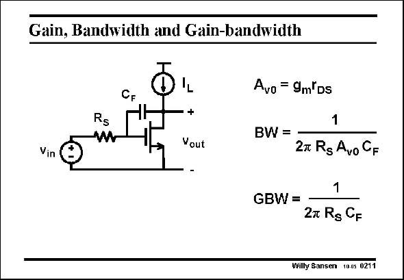
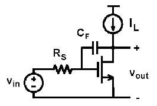

# SANSEN-0211 · 反馈电容对增益与带宽的影响

章节：02 放大器、源极跟随器与共源共栅级  
PDF 页：55；书本页：56；幻灯片编号：0211  
状态：representative_case_visually_reviewed



## Spectre 仿真

本推导组的代表模型已完成 Spectre 验证；覆盖范围以所列网表为准，未逐一搭建所有幻灯片电路。

[本组波形与仿真报告](../../simulations/ch02/index.html#03-miller)

## 第二章公式推导

保留跨接电容的反馈与前馈，得到完整传输及单极点近似的成立条件。

[完整 Markdown 解释](../../derivations/ch02/03-miller.md) · [排版公式网页](../../derivations/ch02/03-miller.html)

状态：derived_in_stated_model；SFG：used。电压／电流混合节点；CF 电流、跨导电流和电阻压降分别建边，逐项追溯局部约束。

模型、近似与来源差异以新推导页为准；下方保留第一步的原始抽取。

## 对应教材讲解

### PDF 55 · 书本 56

Finally, the third and final possible addition of a single capacitance to this circuit, is shown in this slide. It is a feedback capacitance C F from output to input. It is also called a Miller capacitance. Since this capacitance is connected from output to input, it gives the same time constant with the source resistor at the input, as a capacitance C , but GS multiplied by the gain A . v0 Indeed the output has a signal amplitude which is A times larger than the input. Seen at the input, the capacitance C v0 F also seems to be A times larger. v0 The GBW is now completely independent of any transistor parameters. This is expected! Indeed with feedback, the gain becomes independent of the amplifier parameters, and only dependent on the external feedback elements.

## 已核对的抽取

输入与输出间的 C_F 产生米勒效应，放大输入所见电容；在幻灯片的近似模型下，GBW 只取决于 R_S 与 C_F。

- `A_{v0}=g_m r_{DS}` — 低频增益大小。
- `BW=\frac{1}{2\pi R_S A_{v0} C_F}` — 原图所列的米勒主导带宽式；包含大增益近似。
- `GBW=\frac{1}{2\pi R_S C_F}` — 本页近似模型下的增益带宽积。



### 曲线结论


### 条件与近似注记

- 原文明示：这是单独加入一个反馈电容的情况。
- 跨页核对：0212 给出 (1+A_v0)C_F；此页改为 A_v0 C_F，隐含 A_v0 ≫ 1 的近似。
- 模型判读：输入米勒时常数须主导；尚未推导完整双向电容模型、其他极点与零点。

### 连接关系

- v_in 经 R_S 连到共源 NMOS 栅极。
- C_F 跨接栅极与漏极；漏极是输出，并接偏置电流源，源极接地。

## 公式／性能结论候选摘录

以下为规则截取的原文，尚未逐项判读。

- PDF 55: Since this capacitance is connected from output to input, it gives the same time constant with the source resistor at the input, as a capacitance C , but GS multiplied by the gain A . v0 Indeed the output has a signal amplitude which is A times larger than the input.
- PDF 55: Seen at the input, the capacitance C v0 F also seems to be A times larger. v0 The GBW is now completely independent of any transistor parameters.
- PDF 55: Indeed with feedback, the gain becomes independent of the amplifier parameters, and only dependent on the external feedback elements.

## 曲线结论候选摘录

以下为规则截取的原文，尚未逐项判读。

（未由规则找到；不代表原页没有此类内容。）

## 原文条件与近似候选摘录

以下为规则截取的原文，尚未逐项判读。

（未由规则找到；不代表原页没有此类内容。）

## 幻灯片 OCR（未校正）

```text
Gain, Bandwidth and Gain-bandwidth
Rs
-+
Vout
Avo = 9mKDs
BW =
Vin
1
27 Rg Avo GF
1
GBW =
27 Rg CF
Willy Sansen 10.05 0211
```

数学上下标、分数及正负号以原图为准。电路图已保留；未核对的连接不输出成可仿真 netlist。
