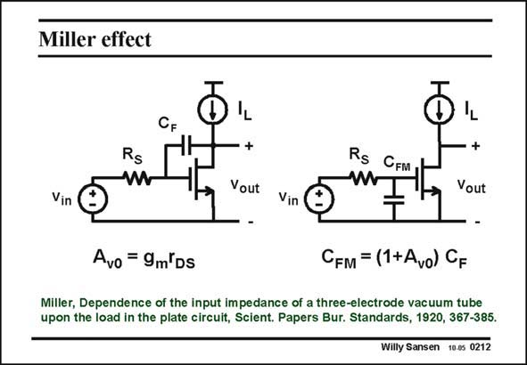
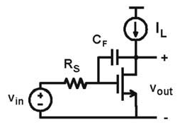
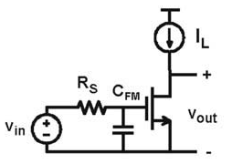

# SANSEN-0212 · 米勒效应

章节：02 放大器、源极跟随器与共源共栅级  
PDF 页：55；书本页：56；幻灯片编号：0212  
状态：representative_case_visually_reviewed



## Spectre 仿真

本推导组的代表模型已完成 Spectre 验证；覆盖范围以所列网表为准，未逐一搭建所有幻灯片电路。

[本组波形与仿真报告](../../simulations/ch02/index.html#03-miller)

## 第二章公式推导

保留跨接电容的反馈与前馈，得到完整传输及单极点近似的成立条件。

[完整 Markdown 解释](../../derivations/ch02/03-miller.md) · [排版公式网页](../../derivations/ch02/03-miller.html)

状态：derived_in_stated_model；SFG：used。电压／电流混合节点；CF 电流、跨导电流和电阻压降分别建边，逐项追溯局部约束。

模型、近似与来源差异以新推导页为准；下方保留第一步的原始抽取。

## 对应教材讲解

### PDF 55 · 书本 56

The same conclusions can be better visualized, in the diagram in this slide. The bandwidth is determined by the same time constant with the source resistor at the input, as a capacitance C , GS but multiplied by the gain A . v0 This Miller effect only applies to the impedance seen at the input. It is not valid for the impedance at the output.

## 已核对的抽取

本页把输入—输出跨接电容转成输入所见的米勒等效电容。正文特别强调，此图的等效仅针对输入阻抗。

- `A_{v0}=g_m r_{DS}` — 正值代表共源级增益大小。
- `C_{FM}=(1+A_{v0})C_F` — 反相增益下输入端所见的米勒电容。





### 曲线结论


### 条件与近似注记

- 原文明示：米勒替换仅适用于此处输入所见阻抗，不能以右图直接计算输出阻抗。
- 核对注记：使用 A_v0 代表增益时须确认适用频段；将 1+A_v0 简化为 A_v0 是额外近似。

### 连接关系

- 左图：R_S 串在信号源与栅极之间，C_F 从栅极跨到输出漏极。
- 右图：输入等效电路以 C_FM 从栅极接地。两图的源极都接地。

## 公式／性能结论候选摘录

以下为规则截取的原文，尚未逐项判读。

- PDF 55: The bandwidth is determined by the same time constant with the source resistor at the input, as a capacitance C , GS but multiplied by the gain A . v0 This Miller effect only applies to the impedance seen at the input.

## 曲线结论候选摘录

以下为规则截取的原文，尚未逐项判读。

（未由规则找到；不代表原页没有此类内容。）

## 原文条件与近似候选摘录

以下为规则截取的原文，尚未逐项判读。

（未由规则找到；不代表原页没有此类内容。）

## 幻灯片 OCR（未校正）

```text
Miller effect
CF.
Rs
RS CEMT
Vout
Vout
Vin
Vin
Avo = 9m'Ds
CFM = (1+Avo) CF
Miller, Dependence of the input impedance of a three-electrode vacuum tube
upon the load in the plate circuit, Scient. Papers Bur. Standards, 1920, 367-385.
Willy Sansen 10.0s 0212
```

数学上下标、分数及正负号以原图为准。电路图已保留；未核对的连接不输出成可仿真 netlist。
